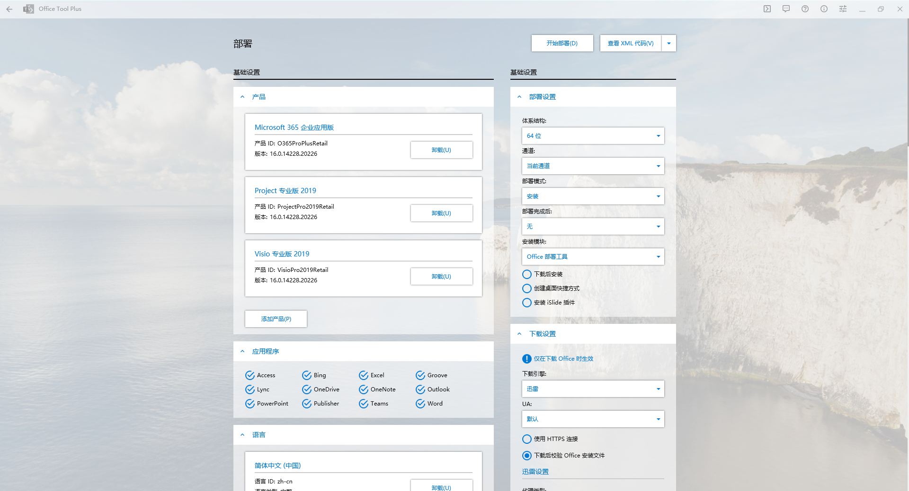
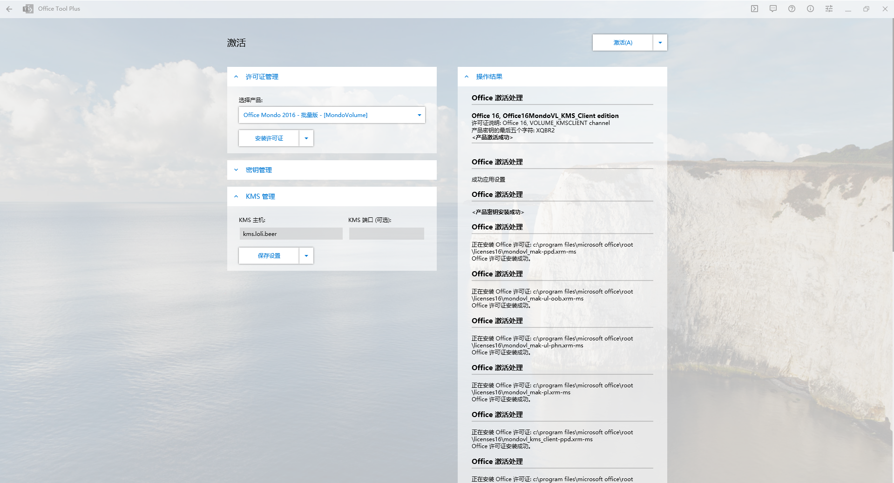

# Office Tool Plus使用教程

## 关于本文档

本文档是Office Tool Plus软件的使用教程。本文档将以Office 365 企业应用版及Project 专业版 2019和Visio 专业版 2019为例，从启动程序、卸载、安装、激活等步骤，介绍Office Tool Plus的使用方法。本文档编写于2021年8月5日，使用的Office Tool Plus软件版本为8.2.4.1，发布日期为2021年7月28日，官方提供的下载链接为[https://otp.landian.vip/redirect/download.html?type=runtime](https://otp.landian.vip/redirect/download.html?type=runtime)。理论上使用版本号不同的软件在操作上并无太大差距。

## 关于启动程序

### 如果电脑中已经装有.NET 5 Desktop Runtime x86

在这种情况下，可以直接运行文件夹根目录下的“Office Tool Plus.exe”以启动程序。需要注意的是，电脑中必须安装有x86版本的框架而非x64版本。

### 如果电脑中未装有.NET 5 Desktop Runtime x86

在这种情况下，运行文件夹根目录下的“RunMe.bat”以启动程序，脚本会自动加载.NET 5 Desktop Runtime x86，随后会自动运行“Office Tool Plus.exe”。如果你想要下载.NET 5 Desktop Runtime x86框架，请访问[https://dotnet.microsoft.com/download/dotnet/current/runtime](https://dotnet.microsoft.com/download/dotnet/current/runtime)。

启动后，会提示需要阅读并接受使用条款。
接下来会出现一个以“微软 CDN 出现比较严重的问题。”为开头的消息提示，点击确定即可。

## 关于卸载

点击主页面中的部署按钮，进入部署界面。

在基础设置下的产品栏目中，可以看到电脑中原有的Office应用程序，点击卸载按钮，卸载全部产品，点击开始部署。

随后程序将唤起微软的产品卸载程序，点击卸载按钮，等待程序执行完毕。

## 关于安装

点击主页面中的部署按钮，进入部署界面。

在基础设置下的产品栏目中，点击添加产品按钮，选择“Microsoft 365 企业应用版”。

再次点击添加产品，选择“Project 专业版 2019”。

再次点击添加产品，选择“Visio 专业版 2019”。

在应用程序栏目中，建议全选，如果了解每个软件的用处可以进行自定义。

在语言栏目中，点击添加语言，会出现简体中文语言包。

在右边的部署设置中，体系结构选择64位，通道选择当前通道。下表为Microsoft 365 应用版更新频道比较。

|                        | 当前频道                                                     | 月度企业版频道                                         | 半年度企业版频道                                                                                        |
| :--------------------- | ------------------------------------------------------------ | ------------------------------------------------------ | ------------------------------------------------------------------------------------------------------- |
| 建议的用途             | 在用户准备就绪后向其提供新的 Office 功能，但没有设定的计划。 | 按照可预见的计划，每月仅向用户提供一次新 Office 功能。 | 用于在需要进行大量测试才能推出新 Office 功能的组织中选择设备。 例如，为了遵守法规、政府或其他组织要求。 |
| 发布频率               | 每个月至少一次（可能更频繁），但没有设定的计划               | 每个月一次，每月的第二个星期二                         | 每个月一次，每月的第二个星期二                                                                          |
| 功能更新               | 在准备就绪后（通常为每月一次），但没有设定的计划             | 每个月一次，每月的第二个星期二                         | 一年两次（一月和七月），当月的第二个星期二                                                              |
| 安全更新（如果需要）   | 每个月一次，每月的第二个星期二                               | 每个月一次，每月的第二个星期二                         | 每个月一次，每月的第二个星期二                                                                          |
| 非安全更新（如果需要） | 通常每个月至少一次（可能更频繁），但没有设定的计划           | 每个月一次，每月的第二个星期二                         | 每个月一次，每月的第二个星期二                                                                          |
| 给定版本的支持期       | 至下一版本发布新功能时，通常约为一个月                       | 两个月                                                 | 十四个月                                                                                                |

设置完成后点击查看XML代码按钮，看到的代码应该一致于或至少相似于下面的代码。

```XML
<Configuration>
  <Add OfficeClientEdition="64" Channel="Current" AllowCdnFallback="True">
    <Product ID="O365ProPlusRetail">
      <Language ID="zh-cn" />
    </Product>
    <Product ID="ProjectPro2019Retail">
      <Language ID="zh-cn" />
    </Product>
    <Product ID="VisioPro2019Retail">
      <Language ID="zh-cn" />
    </Product>
  </Add>
</Configuration>
```

随后点击开始部署按钮，提示确认信息，点击确认，开始进行安装。

安装完成后，界面如图。


## 关于激活

点击主页面中的激活按钮，进入激活界面。

首先需要清除原先的许可证。在许可证管理栏目中的安装许可证按钮旁边的下拉菜单中选择清除所有许可证，弹出警告，点击是。等待程序运行完毕，在操作结果栏目下的文本区域会显示形如：

> Found 97 licenses to install.
> Number of Licenses Uninstalled = 97

这样的文本，表示操作成功。

接下来安装新的许可证。在许可证管理栏目中的选择产品选框中选择“Office Mondo 2016 - 批量版 - [MondoVolume]”，点击安装许可证，弹出注意信息，点击是即可。等待程序运行完毕，在操作结果栏目下的文本区域会显示如下信息：

> <产品密钥安装成功>

表示操作成功。

然后输入KMS信息。在KMS管理栏目中的KMS主机字段填写“kms.loli.beer”，点击保存设置，在操作结果栏目下的文本区域会显示：

> 成功应用设置

表示操作成功。

最后，点击左上角的激活按钮，等待程序执行完毕，在操作结果栏目下的文本区域会显示形如：

> Office 16, Office16MondoVL_KMS_Client edition
> 许可证说明: Office 16, VOLUME_KMSCLIENT channel
> 产品密钥的最后五个字符: XQBR2
> <产品激活成功>

这样的文本信息，表示操作成功。

激活完成后，激活界面的显示如下：


打开Word或其他应用程序，依次点击文件、账户，可以看到产品已激活。


至此，Office 365 企业应用版及Project 专业版 2019和Visio 专业版 2019安装激活完毕。

## 关于注意事项

* 需要注意到，通过Office Tool Plus软件安装的Office应用并不会自动将安装目录添加为环境目录。因此如果需要在命令行中使用excel等命令，需要先将安装目录添加为系统的环境变量。
* 另外还有一个并非由Office Tool Plus引起的使用性问题。在自己使用Outlook应用时，遇到附件不能加载的问题，错误信息为“不能预览此文件，因为没有为其安装预览程序。”通过查阅资料了解到，需要卸载WPS Office应用程序，或者尝试使用以下两种解决方案。

  * 打开WPS Office，在首页\设置\配置和修复工具\高级中，勾选如下三个选项：“Microsoft Word文档(W)(\*.doc,\*.dot,\*.docx文件)及RTF文档”、“Microsoft Excel文档(E)(\*.xls,\*.xlt,\*.xlsx,\*.xlsm文件)”、“Microsoft PowerPoint文档(P)(\*.ppt,\*.pot,\*.pps,\*.pptx文件)”，确定，退出。随后再次进入该界面，取消勾选这三个选项，确定，退出，重启Outlook。
  * 进入注册表管理器，进入到 `HKEY_LOCAL_MACHINE\SOFTWARE\Microsoft\Office\ClickToRun\REGISTRY\MACHINE\Software\Microsoft\Windows\CurrentVersion\PreviewHandlers`目录下。在右侧列表中找到数值名称 `{00020827-0000-0000-C000-000000000046}`并右击删除。删除之后再重新手动创建一下，右击新建->字符串值，把新建的值重命名成 `{00020827-0000-0000-C000-000000000046}`，双击打开把数值数据修改成“Microsoft Excel previewer”，重启Outlook。
