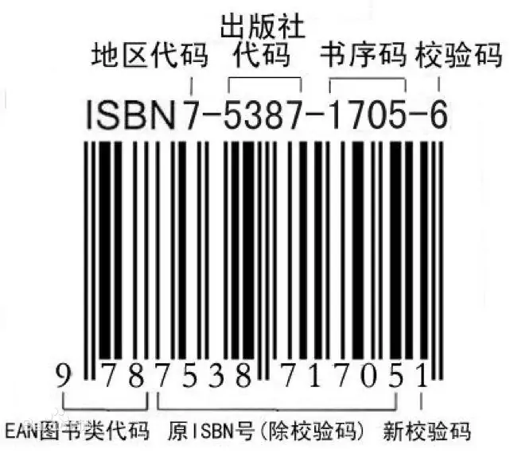
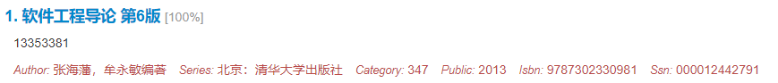

| col1 | col2 | col3 |
| ---- | ---- | ---- |
|      |      |      |
|      |      |      |

# 关于如何获取扫描版出版物的教程

## 前言

本文给出一种能够通过[图书馆查询](http://www.wenxian11.cn/)网站付费获取扫描版出版物的方法，供学习使用。本文编写日期为2021/12/31，给出的网址及相关方法仅保证在当日有效，如遇到相关问题，请联系作者。

## 我需要准备什么

* 需要寻找的出版物的书名、作者、ISBN码等相关信息
* 联网的电脑（包含操作系统）
* 能上网的浏览器
* 一个解压软件
* 2~3元人民币

其中，ISBN码为指国际标准书号，用于检索书籍，每本出版物唯一确定，由13位数字组成，可在书的封底上找到，也可以在网络上搜索出版物的相关信息得到。

2~3元人民币用于向资源提供方付费（非本人）。

## 文件的获取

在浏览器中访问[图书馆查询](http://www.wenxian11.cn/)，在搜索框中输入出版物的ISBN码，以《软件工程导论（第6版）-张海藩-清华大学出版社》为例，其ISBN码为9787302330981。输入并点击搜索后。

### 如果有搜索结果

本文所用例子得到的结果如下：

请仔细核对给出的相关信息是否和目标出版物相一致，如果相一致则点击链接进入资源提供方的商品页面。

商品页面中，标题为一串8位数字，代表该资源在资源提供商的数据库中的ID，此ID应与前文所得到的搜索结果第二行的ID相同。

在购买数量一栏中请填写1。

在邮箱一栏中请填写一个正确的本人邮箱，供购买后的结果查询使用。

格式一栏为一个选项，是资源提供方在付款后给你的自愿形式，有压缩包和PDF文件两种形式，对比如下：

| 属性 | 压缩包 | PDF文件 |
| ---- | ---- | ---- |
| 形式 | 一个压缩包中 |      |
|      |      |      |

## 文件的转换
