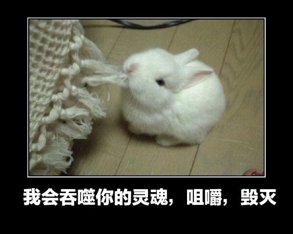
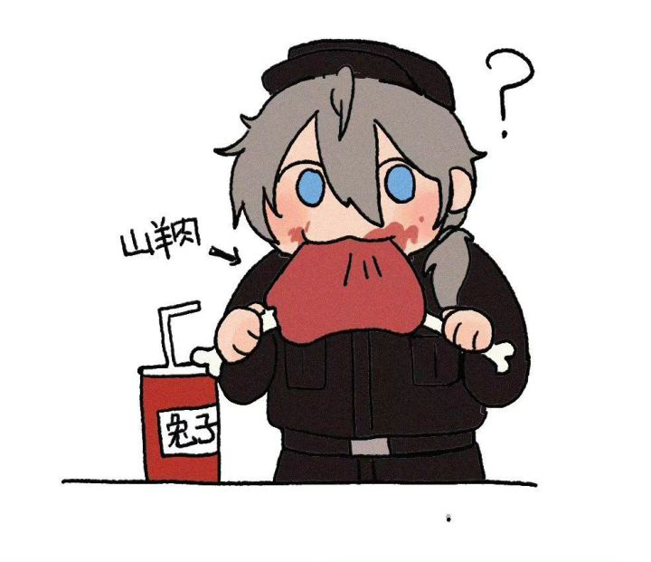
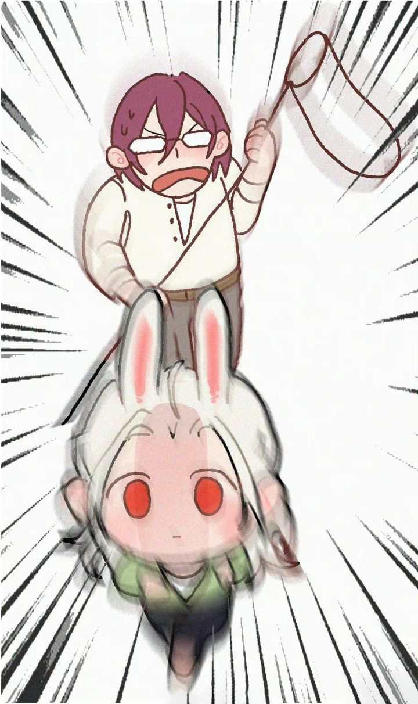

# 动物园规则怪谈

## 市动物园园区游客守则

亲爱的游客，欢迎你们来到本市最大的动物园。我们收录世界上大部分动物，并保证为每一种动物都打造适宜它们的环境，希望您和您的孩子可以观光愉快！在观光游览时，请各位游客务必遵守以下规则，以确保你们的安全，否则后果自负。

1. 本园安全措施保障绝对没有问题，动物没有出逃的可能性，尤其是小型草食动物大多被关押在不可触摸的封闭性环境里。因此，如果您看见路边有逃跑的兔子，请立刻带着您的孩子远离并报告工作人员，不要靠近，不要触摸，尤其是兔子发现并且开始高速靠近你的时候。
2. 猿类的园区只有一条街道，且只展示猿类动物。如果您发现了两条街道，且展示动物包括兔子，请选择左边那条，并尽可能快速地结束对该园区的参观。
3. 大象是一种体型巨大、有着扇子一般的耳朵、鼻子很长、腿粗得像柱子的生物，而且不是白色的。请确保你在大象园区看见的是且只有大象。
4. 动物园的饮料店不提供“兔子血”，如果您在货架上看见了，请不要购买。
5. 不要独自停留在兔子园区的树荫下。
6. 本园没有海洋馆。如果有工作人员向您贩卖海洋馆的票，拒绝他们。
7. 如果您已经看见了海洋馆，立刻离开，并打通地图上标记的电话进行告知。
8. 不要投喂兔子。其余的动物都可以。
9. 兔子不会发出笑声。如果您在参观兔子园区时听见明显不来自游客方向的笑声，离开园区前，请把地图上虚线处撕下来握住，在彻底离开动物园时不要离手。
10. 如果您触犯了以上任何一条，并且发现自己正在迷路状态，和其他熟人走散，请立刻在一刻钟内找到离您最近的饮料店，告知那里穿蓝色工作服的售货员（注意，如果看见穿黑色工作服的售货员，不论对方对您说什么都请假装没听见），他会马上带您到狮子园区的工作通道。不要害怕，这里的狮子不会袭击您，躲在假山后面，等所有的白狮子都开始吼叫后，工作人员将会带你离开园区（请确认他是蓝色衣服），这时候你的家人朋友会在狮子园区门口等着你。在这一切之后，立刻离开动物园。
11. 本园只有四头白狮子。如果在第十条描述的情况中你看见了四头以上白狮子在吼叫，不要离开园区，并告知工作人员，等白狮子数量恢复四头后再离开。
12. 可以给12岁及以下的孩子购买任何动物周边玩具，包括兔子；13-17岁的孩子购买兔子玩偶后，请在一个月内丢弃；18岁及以上的人群不可以购买兔子玩具。
13. 如果看见有戴兔子耳饰的人跟随人流进入大象园区，必须放弃参观该园区。如果违反本条，本园不对您的安全负责，且无法给您提供解决方案。
14. 狮子园区是安全的。如果您遭遇任何您无法解决的危险事件，也无法求助，请立刻、不择手段、尽一切可能前往狮子园区。
15. 警惕和您走散过一次以上的朋友，尤其是他们反复劝你前往海洋馆或大象园区时。

只要遵守以上规则，您就会拥有一个愉快的动物园旅程！您和您的孩子都将收货数不尽的快乐和知识！遵守规则，注意安全，祝您和您的家人朋友玩得开心！

## 市动物园园区员工守则

本园拥有极高的员工福利，十倍加班费和大量年假额度，且为所有员工购买保险。希望您在牢记员工守则的前提下尽心尽力工作，确保自己的安全。生命可贵，仅此一次，为了您的家人请保护好自己，遵守以下规则。

1. 如果发现逃出来的兔子，不要直接进行捕捉，也不要靠近，把它们引到狮子园区，接下来的事请交给白狮子们。
2. 猿类园区只有一条街道，如果有游客汇报出现两条街道，且展示动物包括兔子，请把已经进入园区的游客带领往左边的街道，并关闭园区入口。等所有游客离开园区后，封锁猿类园区至少十分钟。
3. 如果在检查大象园区时觉察到你观测的大象与标示牌上的大象形象严重不符，停止观测并反复告诉自己真正的大象是标示牌上的生物，而不是你所看见的。
4. 如果你在饮料店工作，请每隔一小时检查一次货架，如果发现凭空出现的“兔子血”，马上收起来并妥善保存。
5. 每隔一个月修剪一次兔子园区的灌木，尽量不要让该园区出现遮阴处。
6. 本园没有海洋馆，如果你的同事对你提起海洋馆并肯定它存在，马上停止对话。这个同事已经不是你认识的人了。
7. 如果你看见了海洋馆，不要进入，告诉自己它是不存在的，马上离开。
8. 投喂兔子的时间间隔是七天一次。不可以投喂规定食材以外的任何零食。
9. 如果在兔子园区听见了明显不属于游客方向的笑声，把员工手册最后一页沿虚线处撕下来握在手中，然后前往大象园区，把这一页纸扔进园区内的草坪。其他工作人员会知道发生了什么，不会责备你扔垃圾。
10. 如果有游客向你求助，声称在违背游客守则前提下与家人朋友走散，立刻携带该游客前往狮子园区，交给狮子园区的工作人员，他们会知道怎么做。在此期间你可能会遇见穿黑色工作服的同事试图参与你的工作，拒绝并无视他们。他们不是你的同事。
11. 狮子园区的白狮子只有四头。在白狮子突然增加到四头以上的时候，把“兔子血”拿出来给它们看，并把它泼向立刻跑过来的第一头白狮子。做完这一切后，立刻离开。不要在此期间盯梢多出来的白狮子。
12. 不要私藏/整理/进货/使用兔子周边。本园出现的所有兔子周边都尽量不要触碰。如果游客提出购买兔子周边，确认即将拥有它的人未成年，否则不要售出。
13. 如果看见有兔子耳饰的人进入大象园区，马上驱散附近的游客，并守在大象园区门口直到听见园区内有孩童尖叫声为止。
14. 在五分钟内感觉到耳鸣/胸闷/偏头痛/眼睛红肿是正常现象，不必多虑。但如果该现象超过五分钟，立刻停止工作，不择手段尽你所能快速地前往狮子园区。
15. 友善地对待白狮子们。在白狮子数量只有四头时，不用对它们有所任何防备，它们从小被训练亲近人类。**如果你不幸被正常状态下的白狮子袭击但没有当场死去，第6、7条守则作废。不要急着去医院，你不会死。离开狮子园区之后，前往海洋馆，你会很快发现它。你将穿上黑色的工作服。**

## 海洋馆门口张贴告示

如果你有幸能看见这张告示，请不要声张。让其他人发现你能看见是忌讳的。相信你可以从地图上的守则看出来，这个动物园并不安全，甚至诡异。我们是立志于保护无辜游客的暗访政府组织，请务必遵循以下规定以保证你的生命安全，这是你逃出这个动物园的唯一渠道。

1. 进入海洋馆，这里没有人，在门口直接领取黑色的制服穿上。这是向我们工作人员发送接受被救援信号的唯一方法。当你在外面走的时候，我们的工作人员会注意到你的衣服。不用担心动物园正式员工找你麻烦，他们不会搭理你。
2. 不要去狮子园区。
3. 确保你所在的任何位置都有兔子，逃跑的兔子、兔子周边玩具、带兔子耳饰的人，或者饮料店的“兔子血”。兔子是我们的暗号，它们象征“安全”与“保护”。
4. 参观大象园区时，不要看标示牌。
5. 不要相信地图上任何一条标语，也不要照做。如果你做了任何一条，请立刻检查动物园入口提供的每人一张的地图上标有虚线，沿虚线撕下来，前往兔子园区，并尽可能不被发现地把这一张纸喂给兔子，然后停留在这里。等你听见明显不来自游客方向的笑声时，就可以离开该园区了。在这之后，请前往猿类园区，安全出口在右边街道的尽头。

## 游客捡到的纸条，边角写有字迹潦草的“**逃走**活下去”

1. “兔子血”不存在，是“山羊肉”（这条被反复写上又划去，看不清划掉的内容）
2. 山羊园区是大象（这句话下面画了一张歪歪扭扭的长着兔子耳朵的大象）
3. 兔子会吃掉猿猴（这句话被划去，并在猿猴一词上圈记了问号），在猿猴园区不能和工作人员说话，不能出去，不能投喂猿猴，不能在只有一条路时进入
4. 不能在没人时进入海洋馆
5. 只有“山羊肉”是可以吃的
6. 如果海洋馆晚上关了灯，可以在海洋馆过夜，他们不会锁门
7. 前四头白狮子是猿猴，第五头白狮子是山羊，兔子是大象，蓝色是黑色（这句话被加了重点）
8. 你是大象（这句话字迹极其潦草）
9. 我是山羊（这句话字迹异常工整）

## 海洋馆内部张贴告示

1. 不要在有人时进入海洋馆。如果你进来后有工作人员接待了你，在看完这条告示后请立刻找借口离开。
2. 如果你看见这条告示为止，都没有工作人员出现，可以留下来参观、休息。这里的食品都是免费供应，可以自行拿取，但是不要食用“山羊肉”，如在货架看见如此标识的食品请无视。
3. 如果你在16：00之前进入，在海洋馆内停留时间不可多于半小时。
4. 如果你在16：01之后进入，在海洋馆内停留时间不可少于四小时。
5. 这里是海洋馆，只会存放海洋生物。如果你在鲸鱼区看见在水里游泳的大象，请不要大声呼喊或者做出张扬反应，那是出于趣味性放置的3D投影特效。平常对待，假装那就是鲸鱼。
6. 海洋馆可以用于过夜，水母区的左手边有提供给流浪汉或者旅行中游客的临时钟点客房。如有必要使用，请在入睡前关闭房间内置的水母小夜灯。
7. 我们的工作人员统一穿红色衣服，且只在晚上12：30后对海洋馆进行每日例行打扫检查。如果遇见黑色工作服的人自称海洋馆工作人员，可以与之对话，也可以同意让对方担任暂时导游，但不要把你的地图交给对方，尤其是沿虚线撕下的部分。
8. 违背以上条例，安全问题后果自负。
9. 海洋馆存在，且不服务于任何组织。

## 海洋馆员工守则

1. 海洋馆白天不需要工作，你的上班时间为晚上12：30~次日6：00。可以适当迟到早退，但千万不要早到和加班。
2. 水母区左手边的钟点客房给附近的流浪汉和有需求的游客准备，上班后请检查他们是否在1：00之前关闭水母小夜灯。如果没有，提醒他们直到他们关闭。你有权强行关闭水母小夜灯，不论如何，不要在1：15后让水母小夜灯依然亮着。
3. 鲸鱼区溺亡的大象尸体是正在实验中的3D投影技术，不管它看起来多真实，不要管，无视它就好。也不要探究开关位置，它没有被关闭的必要。
4. 监控室的设备已经损坏且不便维修，所以请每个小时巡逻一次。突然停电和不明噪声是正常现象，不用担心那些鱼的安全。如果感到不安，可以在水母区休息。水母区供电设备完善，绝对不会停电。
5. 外来游客手持动物园地图是正常的。不要回答“海洋馆在动物园哪个位置”的话题，对方如执意追问，可以马上离开。
6. 周日下班前要记得给水母小夜灯充电，不论如何不要忘记。
7. 每天更换一次货架上的食品。如果发现标注“山羊肉”的陌生食品，请单独收到鲸鱼区的收纳箱里面。会有人替你处理。
8. 工作期间可以在馆内任何地方散步，但是不要离开海洋馆。如果借宿的游客试图在凌晨6：00之前离开，尽可能劝阻他们。拦不住的话不必起肢体冲突，也不必跟着他们离开，继续做你自己的事就好。
9. 如果借宿的游客穿了和你相似但是是黑色的工作服，拒绝他们的留宿，用强硬手段把他们赶走。水母区的工作台放置有电击棒和麻醉枪。
10. 如果借宿的游客携带了兔子周边，在他们睡着后偷走，放置到鲸鱼区的收纳箱里面去。游客醒后不会追问你。
11. 如果借宿的游客试图和你聊天，你可以聊，只要不耽误及时关灯。不要在话题里提到“动物园”，如果对方提起，马上转移话题。
12. 海洋馆独立运营，外面没有动物园。牢记这一点。

## 三年前的大象园区工作的保安贴在安保室里的便签条

与我换班的人、偶然来到安保室的人，或者以后看见这张便签条的新人，你好。在你的工作期间请一定按照便签条的要求去做，这是我累积下来能保持安全和精神稳定的工作经验。我不希望再失去哪个同事，不希望再经历莫名其妙的事。我相信你也不想。看完这些忠告后就假装没看见地做你的事吧。

1. 时刻记住你衣服的颜色。它可以是任何颜色，红色的、蓝色的、黑色的。不要变更衣服的颜色。保持对自我认知的坚定是非常重要的。不要让“它”发现你在对外界的认知迟疑惶恐、举棋不定。
2. 去相信。去相信。去相信。人类是值得你去信任的，只有人类值得。
3. 兔子会吃人，带兔子耳饰的人不会。树荫会吃人，修剪树荫的人不会。大象会吃人，看大象的人不会，不看大象的人也不会。白狮子会吃人，发光的水母不会。（稚嫩仿佛孩子的笔迹：因为水母没有脑子吗？）
4. “它”被阻止会哭，“它”成功了会笑。不要管“它”是什么，只要发现了“它”就要远离。他们还不知道。
5. 莫名其妙出现在任何地方货架上的食物都是试探。不要看食物上面的标示牌，也不要管别人如何称呼它。无视，必要的话当成普通食品购买并吃掉。不要让“它”知道你已经察觉到“它”了。

## 动物园园长办公室文件

（无标题，无导语，只是一份打印的文件，用胶带死死贴在木桌子上）

1. 接受任何员工，不管他们穿了什么颜色的衣服。虽然动物园只提供蓝色工作服，但如果有人穿同款式的黑色/红色工作服出现，请把对方一视同仁作为员工对待。
2. 在无人的时候，办公室门外出现孩子的哭声和笑声都是正常现象。无视，假装没有听见，切忌表现出不安或者烦躁。
3. 不允许员工把宠物带来动物园，如有人执意违反，不必罚款，只需要求对方后果自负。
4. 每三天检查一次狮子园区的白狮子数量，并把白狮子数量变化频率记录下来，存放到电脑文件夹“它”的表格里。不要追究“它”指的是什么。不要给文件重命名。不要和别人谈论这个文件夹，包括家人。
5. 每张地图上必须存在可以按虚线撕下来的部分，地图需由特定厂商生产。厂商联系方式在文件夹的word文档里。办公室需要常备至少三张地图供随时使用。
6. 不管大象园区的保安辞职频率多高，要求福利多离谱，善待他们，尽可能满足他们的要求。他们不是在无理取闹。但最好不要深究他们如此要求的原因。
7. 检查员工工作时，如果看见员工捕捉逃走的兔子、捡回干涸的水母或者被白狮子咬死的兔子，是正常现象，不必指责或追问；但是请检查他们的确妥善处理完毕。
8. 办公室在凌晨1：15~6：00之前必须保持开灯状态，哪怕没有人。这里的供电设备比任何园区都强，停电是不正常现象，如果出现，立刻把办公桌右手边备用的地图按虚线处撕下，然后握在手中走出。告诉你遇见的第一个员工这件事，不管对方穿什么颜色的衣服、正准备去做什么事，要求对方去帮你处理停电。他不会拒绝你的。
9. 不要深究海洋馆是否存在。但如果你看见了海洋馆，可以进去走一走。在海洋馆外请遵守门口张贴的告示，在海洋馆内请遵守内部张贴的告示。如告示有矛盾处，根据你看见告示时身体所处位置决定尊重哪一条。
10. 办公室的沙发上只摆放了猿猴玩偶和白狮子玩偶。出现山羊/兔子/大象玩具时，今天没有在室内办公的必要。离开，直到监控室员工通知你多余的玩具消失。
11. 可以午睡，但如果决定上夜班，不管用什么方式打起精神，不要打盹。如不确保自己的精神状态，不要上夜班。
12. 监控器偶尔会损坏，判断是否是正常损坏请检查摄像头上是否有动物毛发。如果有，一个月内不要修复监控器，有需要的话可以自行准备微型摄像头替代，告知情况后财务部会对摄像头费用进行报销。
13. 垃圾桶出现干涸的水母是正常现象，清洁工来丢垃圾时提醒一声就好。
14. 如果违背以上任意一条，假装什么也没发生在办公室度过13小时，就餐请点外卖，并联系员工给你送进来。不要离开办公室，不要正视外卖员和员工，不要看镜子。时刻提醒自己人类有两只眼睛，且只有两只眼睛。
15. 时刻记住，人类的生命安全比动物的更加重要。必要时牺牲任何动物。不要心软，你不知道它们是不是动物。

## 不知什么人遗留在海洋馆水母区左侧客房的纸张，已被员工放置鲸鱼区储物柜

（纸张开头和边缘写满了“好害怕”“我想活着出去”“不要相信”“要相信”“全乱了”“必须记下来”，应该写标题的地方被加重的黑笔重重写上“不这么做的话绝对出不去了”）

1. 猿猴和白狮子能看见“它”，水母和兔子能安慰“它”，大象和山羊是“它”的玩偶
2. 相信白狮子；白狮子咬有救的人，白狮子咬没救的人，白狮子的吼叫是驱逐“它”的警铃，白狮子的吼叫是悼念亡者的哀歌
3. 换衣服会被发现，不要换衣服（潦草且癫狂的字迹备注：团结、勇气和绝不动摇的忠诚是人类最大的优点）
4. 大象区的保安是可以信任的，但是他们每天凌晨1：00会下班，要在这之前求助
5. “它”喜欢灯光，尤其是晚上，“它”讨厌密闭空间，要在黑暗的密闭房间休息
6. 我操！山羊肉是真的生肉啊！（这句话比其他句子更加潦草；后面有一行稍微不那么潦草的字迹批注：居然他妈的能吃）
7. 和猿猴站在一起的时候不会被发现
8. 人类是两只眼睛的，而且横着排列，分别在鼻子两侧，其余的都不是人类。人类的样子变了，说明在被“它”看着，要记住人类，不要相信不是人类的人类
9. 笑着游览的游客不要搭理，他们什么都没发现。寻找和我一样害怕的游客，他们是可信任的，他们已经知道了
10. 感谢干涸的水母和溺死的大象；记住它们都是为了保护人类而死的
11. 有出口，不在猿猴园区，不知道猿猴园区出去是什么
12. 时刻记住自己是人类，不是动物

## 解读

根据作者本人亲自认定，本故事存在唯一解。我们相信，再复杂的谜题也有破除的机会，这也是本次讨论所存在的基础。值得强调的是，在接下来的解析之中，我不会模糊处理任何字眼，不存在一笔带过的情况，而一定会把所有信息都解读清楚。因此会写得非常长，请耐心阅读。

首先，让我们共同回顾一下题目吧。在这个过程中，我会向大家一一解释，每一方势力，每一条规则，每一张纸条，所有的疑点。由于篇幅所限，为了便于阅读，请在阅读本文的同时备好谜面，时刻查找原句。

在我浏览长达6500字的谜面之前，先看到的是作者给出的三条官方线索：

> 1. 不同势力的各个规则之间存在因果关系；
> 2. 兔子血和山羊肉为同一种物质；
> 3. 目的是“逃离”而不是“维护”；

不知道大家阅读完以后，是否能形成一些先入为主的概念。在没有任何联动信息的情况下，我们仅能对线索本身进行解读。

第一条明确指出，动物园内存在不同势力，且规则不只有同一套。至于我们应该相信哪些、排除哪些，一定会有相关的依据供我们筛查。而它们之间的因果关系，恰恰对故事的顺序性起到了提示作用，很可能暗示了某些重要信息；

第二条提及“兔子血”和“山羊肉”两种东西，居然是同一种物质。且不论固态和胶体之间的区别，这条线索已经跨越了物种差异，成为了生物学上的奇迹。在这个基础上，我们可以做一个大胆的猜想，那就是： **兔子并非是真的兔子，山羊也并非我们所熟知的山羊。** 而这两个食物般的词汇，或许是其他东西的代号而已，或许是某种有特殊效果的化学产品。现在的我们只需留意，等到以后再解决即可。

相比而言，第三条则显得有些闪烁其词。所谓“目的是逃离”，主体是谁？是谁要逃离，而又想逃离到什么地方去？至于维护，则又是维护哪些东西？是某个势力吗？带着无数的疑问，我们意识里，已被作者种下一个行动逻辑，那就是“ **逃离** ”。无论去哪儿，都必须偏离原本的轨迹，防止某些必然迎来的危险发生。

接下来，规则共分为九个部分，全都以条例格式书写，它们分别是：

> 1. 动物园游客须知
> 2. 动物园员工守则
> 3. 海洋馆门口张贴告示
> 4. 可疑的纸条
> 5. 海洋馆员工守则
> 6. 海洋馆内部张贴告示
> 7. 大象园区保安便签
> 8. 园长办公室文件
> 9. 鲸鱼园区储物柜纸张

（以下可能会简称为文件1至文件9）

（无论是地图上的虚线部位，还是员工手册的最后一页，以下都简称为“虚线”）

由于格式特殊，作者达成了代入感强烈的视觉效果，同时使得某些相关联的信息，被安排在了不同的位置，导致我们在阅读过程中遇到了较为复杂的整合问题。许多人在推理时，总是将目光聚焦于其中相反的规则上，如“远离兔子”和“相信兔子”，就下意识判断其中必有一对一错，这恰恰陷入了误区。

因为我们此前接触到的大多数题目，都是没有区分主体的。同样一则信息，故事中的行为主体A可以使用，行为主体B同样可以使用，不存在区分身份的环节。而在本故事中，共有9个文件，各有各的书写者和适用者，倘若一概信了，或是一概不信，那么你就是永远走不出这动物园的人员之一。

在文件9中，某人曾用潦草的字迹批注告诉我们：

> 团结、勇气和绝不动摇的忠诚是人类最大的优点。

作者在故事中使用的语言非常平实，导致这句文艺的话看起来如此突出，其可信度颇高；加以本句不含有任何硬性信息，那么， **我们不妨将团结、勇气与忠诚三项优点，作为人类的精神武器。** 不论人类与动物，或是人类与“它”之间有何种对抗关系，我们都可以先将人类整体作为正面形象来分析。由此，我们做出以下推理。

经过梳理，提取信息过后，我们可以得知，在不包括戴兔子耳饰的个体、动物园园长和各种特殊个体的情况下，本故事共有4类人群：

> 1. 穿蓝色衣服的动物园员工
> 2. 穿红色衣服的海洋馆员工
> 3. 穿黑色衣服的暗访组织人员
> 4. 游客

值得留意的是，这四种人类是存在流动关系的，并非固定不变的状态。

我们可以推出以下结论：1、2、3都不可以变为4，1、2、4都有机会变为3。

（是否说明了游客实现“逃离”目的的希望最大，而暗访组织人员实现的希望最小呢？）

且1、2互不承认对方存在，1、2共同在某种程度上排斥3的工作。

但也请注意，规则中所提到的所有情况，都不包含“人类攻击人类”的说法，最过分的不过是文件5中所提出的“强硬手段”，但目的也仅仅是“用电击棒和麻醉枪供你使用”，来驱赶穿黑色衣服的暗访组织人员。因此，我们可以认为，**人类是不会对人类造成伤害乃至杀害的。**

3同时承认1、2存在，3与4被要求做几乎完全相反的行为。

总共有9种动物：

> 兔子、猿猴、大象、白色大象、狮子、白狮子、山羊、鲸鱼、水母。

其中，提及“白色大象”的文字称这种动物不是大象，但既然它可以被人看到，说明是有实体存在的。我们仍将这类动物算入此列，毕竟人家是活的。

包括狮子与白狮子的辨析，此处作者的描述不够明确，我们无从得知是否所有狮子园内的狮子都为白色，而接下来的推理过程，只会涉及到白狮子，可默认不存在正常颜色的狮子。

接下来，让我们整理一下提及且没有与其相悖的信息。这些信息是可以确认无误的，值得被我们信赖，作为信息推算其他部分。

### 一、初步整理

1. 动物园内的兔子有一部分被关押在封闭环境里，没有逃脱的可能性。说明在路边的兔子不会是从这种环境里逃出来的，而是额外出现的。
2. 兔子园区内的树荫是不能逗留的，会“吃人”，因此动物园员工必须每个月清理一次。
   （所谓吃人，也许是其他含义）
3. 兔子玩具只能被未成年人拥有，一旦被成年人触碰可能会产生某种后果。
4. 大象园区内出现的动物有些不是大象，它们与定义中的大象存在某些区别。在大象园区内工作的保安可能比较熟悉这一情况，而这或许跟他们福利待遇极高有关。
5. 兔子每7天需要投喂一次，其他时间内，不允许动物园员工向兔子投喂任何东西。然而暗访组织人员会被要求将“虚线”喂给兔子，而此时会听到不来自游客方向的笑声，这种情况大概就是动物园员工和游客们应该避开的情况。
6. 水母夜灯每7天需要充电一次，海洋馆员工被强调一定不能忘记这件事。
7. “虚线”是被所有人群重视的物品。它被撕下以前毫无作用，但被撕下以后，对人类和动物都会产生作用，而这种作用可能会因为主体的不同，而随之发生改变。
8. 海洋馆水母区的供电是最足的，动物园园长办公室供电也是最足的，两者之间可能有某种联系。一般情况下，这两个地方都不会出现停电的情况。
9. 穿红色衣服的海洋馆员工与穿蓝色衣服的动物园员工在遵守各自规则的前提下，是不会有见面的机会的。而穿黑色衣服的暗访组织人员则不同，他们被红、蓝两类员工以不同程度排斥，而且在动物园和海洋馆都有他们的身影。
10. 海洋馆可能会出现溺死的大象，动物园可能会出现干涸的水母。人类应当感谢这两种动物，它们是为了保护人类而死的。却没有明确地提示我们，它们究竟做了什么。
11. 保持对自我认知的坚定是非常重要的，这是为了防范“它”的某种作用。“它”与兔子血和山羊肉有关，与不来自游客方向的笑声有关，与白狮子的数量有关。它具有趋光性，无法分辨猿猴和人类的区别，被它作用的人类，模样会发生变化。
12. 动物园和海洋馆的工作人员都有严格的上班时间，不允许违背。
13. 动物园园长的位置可能会被不同的人替换，也可能是同一个人常常失忆，否则不会以文件8的形式对自己进行反复强调。园长与“它”存在某种对抗关系，园长与员工的共同目的是帮助游客逃离动物园，但园长和员工都会遇到不同程度和形式的危险。

信息量有些过大，我与大家一样，起初很难把这些信息串在一起，形成一个完美的逻辑。

于是我想从一切的开头部分做起，也是本故事之中最特殊的存在——“它”。

关于“它”，我们一无所知。似乎所有的动物，都与它牵扯得上关系：

> 猿猴和白狮子能看见“它”；水母和兔子能安慰“它”；大象和山羊是“它”的玩偶。

等一等，鲸鱼去哪里了？

我们这才发现，原来所有文件之中，都没有提到过鲸鱼的存在。或许海洋馆内设有鲸鱼区，但那其中，只有大象溺死过后的尸体。而在诸多线索之中，我们发现，大象与水母的死法尤其蹊跷。我们知道，大象本该在动物园内，而水母则应该在海洋馆内。可是它们却出现在不被各自园区的工作人员所承认存在的地方，究竟发生了什么？我们可以肯定的是，这一定不是它们的本意，更像是被“它”报复的结果。至于所谓“为了保护人类而死”，它们真的做过什么事吗？

我们不知这是何意，却可以很轻易地看出，“出于趣味性放置的3D投影特效”是个骗局。然而，“假装那就是鲸鱼”又是为什么？是为了“不要让‘它’发现你在对外界的认知迟疑惶恐、举棋不定”吗？“它”是否正是凭借这种认知上的差异，来促使“人类”不再彼此信任，甚至对自己是否还是人，产生了怀疑？

在那之后，人类会发生什么？

根据“人类的样子变了，说明在被‘它’看着”可知，当人类A被“它”所作用时，A会怀疑自己不再是人类，而在B眼中的A，就已经不是人类了。这并不代表B也受到了“它”的影响，因为在其他人眼中，B仍是正常的游客或员工，危险的只有A而已。

紧接着我们会注意到文件2所提到的，一旦出现超过五分钟的“耳鸣/胸闷/偏头痛/眼睛红肿”症状，员工应当立刻停止工作，不择手段尽你所能前往狮子园区。注意，“眼睛红肿”可是兔子的象征，这是否意味着，员工一旦不慎触碰了兔子血，或是有其他影响认知的行为，就会被“它”所盯上，然后变成那些额外出现的兔子呢？那些在路边逃走的兔子，是否就是如此产生的呢？

而兔子的行为也很耐人寻味。有些兔子可能会“发现并且开始高速靠近”人类，我们不得不怀疑已经变成兔子的人类，也可能继续通过接触人类而变出更多的兔子来。而有些兔子会被游客或工作人员发现，这时按照规则，它们也会被引向狮子园区，和那些感到身体不适而主动前往狮子园区的人一起，与白狮子们发生某种作用。

白狮子是一种怎样的存在呢？在文件9中，我们看到人类应当“相信白狮子；白狮子咬有救的人，白狮子咬没救的人”。表面上看来这是一句废话，甚至会诱导我们猜测文件9的书写者与文件4的书写者一样，也是精神状况不太正常的人，从而怀疑起信息的真实性。

事实上，除了有救的人和没救的人以外，白狮子还会遇到另一类人。那就是文件1所提到的那种虽然违反了某些规则，却侥幸未被“它”所影响（或受影响极轻）的游客。而那种游客只需“不要害怕，躲在假山后面”即可，因为白狮子不会攻击他们。这时白狮子的吼叫，便是“驱逐‘它’的警铃”，因为白狮子是可以看见“它”的，所以对“它”施以吼叫的白狮子能看见在吼叫以后，此人是否已经安全。这一类人受到的影响很轻，所以此时已经安全，会被送出动物园外，这样就算成功逃离。

由此我们可以推算得知，完全按照文件1，即游客守则行事的游客，是不会被“它”所盯上的，同样能够安然无恙地逃离动物园。

**至于“白狮子咬有救的人”，指的是白狮子会咬伤那些受到一定影响的员工或游客，以达到驱赶“它”的效果。** 白狮子当然也会先以吼叫的方式恐吓“它”，企图使“它”退散，然而这类人受到的影响更深，只好采取更进一步的撕咬方式了。由于四头白狮子是受到过培养的，只会针对“它”来进行攻击，不会把这类人给咬死，因此他们虽然受了伤，但的确不需要去医院。但我们无从得知的是，文件2的最后一条内容提到“你会发现海洋馆，并将穿上黑色的工作服”，却整段被划去的原因是什么。我们只好留到后面再分析这一点。

因此，这类人受伤以后，由于该规则已被删除，按照正常流程，一定会去医院。也就意味着他们也算是逃离动物园了。至于这条规则被删除以前，被白狮子咬伤的人会去往何处，我们暂且打个问号，现在解决不了，早晚能解决。

**继续分析“白狮子咬没救的人”，指的是白狮子会直接咬死那些无论如何也赶不走“它”的游客或员工。** 比如那些已经变成兔子的人，会被引导去见白狮子，这里的一句话非常有趣，“接下来的事请交给白狮子们”，其实并不是完全交给它们了，因为白狮子们咬死兔子以后，还会有园长负责“检查员工工作时，如果看见员工捕捉逃走的兔子，或是捡回被白狮子咬死的兔子，是正常现象，不必指责或追问；但是请检查他们的确妥善处理完毕。”此处的兔子，其实全都是白狮子咬死了的没救的人。对这类人而言，白狮子的吼叫已经不再是“驱逐‘它’的警铃”，而是“悼念亡者的哀歌”了。

这里也能窥见一部分“它”影响人的方式。根据“它”的特点，我们可以推测， **“它”并非是依靠光来使人产生认知偏差的，而是借助光下产生的影子。** 这就是为什么凌晨一点以后，海洋馆的水母夜灯必须全部关闭的原因。而所谓“树荫会吃人”，也并非是真的把人吃掉了，而是记录者的一种主观想象。

虽然书写文件7的那位保安心理素质过硬，且从业经验丰富，他也的确是个真心想要保护其他人的好人，但他一定也有不能完全看清的原理，那就是 **信息不足所导致的误差。** 事实上，树荫不会吃人，兔子也不会吃人，只是“它”会借助树荫使人产生认知偏差，从而怀疑自己不是人，而是兔子，接着就会变成兔子罢了。当这位保安能看见兔子时，就自然认为是“兔子会吃人”；当他看不见逃远了的兔子时，就认为是“树荫会吃人”。

“它”想要把越来越多的人类变成兔子，一定有它的企图；然而白狮子却能咬死兔子，这自然是与“它”的愿望相悖的。我们此前分析过，人类应当感谢大象和水母，而大象和水母可能正是死于“它”的报复，那么，小心眼儿的“它”出于仇恨，没有不去对付白狮子的理由。我们继续提取信息，不难看出狮子园区里还会出现一些怪事，那就是：

**白狮子的数量会发生改变。**

根据文件1我们得知，动物园强调“本园只有四头白狮子”，又提到会有“四头以上白狮子在吼叫”的情况出现，言外之意就是说，只有前四头白狮子存在的情况，才是人类希望看到的正常情况，而这四头白狮子的职能，我们已经分析完毕。第五头乃至更多的白狮子，则是“它”在捣鬼。想要继续推理下去，必须结合文件4来看。

> 前四头白狮子是猿猴，第五头白狮子是山羊。

要知道，文件4的书写者最终以无比工整的字迹写下了“我是山羊”，代表着他已经不再是人类了。而就在上一行，他还潦草地写下了“你是大象”，也传达出两点信息：一，大象也是由人类变来的；二，山羊或许能够代表“它”的意志，仇视大象，且以某种方式对付大象。

并且，山羊也是人类受到“它”的影响而变化来的。只是这一路径，一定区别于兔子的变化，否则山羊和兔子就没有必要进行区分了。

这也暗合了“兔子血”和“山羊肉”的名称，纵然它们是同一种物质，但不代表山羊和兔子就能完全划等号。

这时我们无奈地发现，在分析白狮子的过程中，必然还会牵扯到其他动物，也少不了讨论工作人员进行弥补的措施。由此，我们不妨把大象园区也纳入分析范围，看它们之间究竟存在多少瓜葛。

先来谈谈“前四头白狮子是猿猴”。这些清道夫一般的白狮子是从哪里来的，这一点仍然存疑。由于文件2中提到“它们从小被训练亲近人类”，我们不禁怀疑，哪有狮子是这样子的？也许有一种可能，这些白狮子也是由人类变成的。而此处又提到，白狮子是猿猴，那么我们不妨这样假设：

> 人类经过某种特殊作用，可以变成猿猴，而猿猴还会经过某种特殊作用，最终才能成为白狮子。

那么，“第五只白狮子是山羊”，又有什么含义呢？根据上面的分析，我们知道，山羊是为“它”卖命的使者，而作为山羊的使命，正是前去狮子园区，变成第五头乃至更多的白狮子，与前四头白狮子进行以命搏命。

根据“白狮子数量会恢复四头”的信息，我们可知，在工作人员的参与下，白狮子最终会再次变为四头，而在这个过程中，为了维持秩序，山羊变成的白狮子一定会走向灭亡。

值得补充的一点细节是，白狮子不是很厉害吗，为什么还需要工作人员的参与呢？

在文件2中我们看到员工的正确做法是：

> “在白狮子突然增加到四头以上的时候，把‘兔子血’拿出来给它们看，并把它泼向立刻跑过来的第一头白狮子。做完这一切后，立刻离开。”

因此我们不难看出，已经变成白狮子的山羊仍然有一种特性，就是对“兔子血”也是“山羊肉”的渴望。这点在文件4中可以得到印证，也就是那个最终变成山羊的书写者，所产生的一种错误认知：

> “只有‘山羊肉’是可以吃的。”

于是，本来无法辨认山羊和白狮子区别的前四头白狮子，可以很快地扑上去把多出来的白狮子给干掉了。然而，山羊可以被杀死，难道前四只白狮子就不会出现伤亡吗？

真实情况是：如果最终只剩下了三头白狮子，那么狮子园区的员工就会将猿猴拉入该园区，使猿猴变成白狮子，则园区内将再度变为四头白狮子。然而，这一过程一定不是即时的，否则动物园园长每三天记录一次白狮子的数量的行为将会变得毫无意义。因此，白狮子的数量可能会多于四头，可能会等于四头，也可能会少于四头。文件4的记录者正是目睹了猿猴变成白狮子的过程，才会将这一事实记录下来。

因此我们知道，猿猴变成白狮子，需要满足的条件是：原有的四头白狮子出现了缺位，需要由替补来顶上的时候。

那么，猿猴与山羊，又是如何到狮子园区来的呢？毕竟，我们从未在任何一个文件中的任何一条规则中，见过“逃离的猿猴”或“山羊”这种东西。

我们自然而然想到了猿猴园区内有时会出现的第二条街道。对游客或员工而言，猿猴园区只有一条街道是正常情况，而一旦出现了两条街道，往往会伴随着兔子出现，这时一定要快速通过左边的一条街道。说明左边的那条街道，正是第一条正常的街道，是可以安全离开猿猴园区的一条路。然而，有时会出现的第二条街道，一旦通过又会发生什么呢？

依靠以上的信息是无法得知的，我们必须扩大分析范围。文件3中明确提到过，一旦穿黑衣服的暗访组织人员实行了任何文件1中的规则，那么就应该将虚线喂给兔子，等到能够听见不来自游客方向的笑声时，就可以前往猿猴园区，选择右边街道的尽头，那就是安全出口。

这其中包含的信息也是极其丰富的。让我们来抽丝剥茧地分析吧：

先从行为主体出发，为什么一定要是遵守过文件1的穿黑衣服的暗访组织人员，才会被要求做这一系列的动作？他们的行为是否会带来某些后果，需要被弥补或是进行某种其他作用，才会前往所谓的“安全出口”？

结合文件1、2可知，猿猴园区的街道只有左边那条是安全的，且只是离开猿猴园区，而不是离开整个动物园。不难得知，即使右边街道的尽头不存在危险，也是无法直接离开动物园的。

结合文件9可知，想要逃离动物园是有出口的，只不过这个出口不在猿猴园区，且“不知道猿猴园区出去是什么”。能被称为“出口”的猿猴园区街道，只有右边那条街道，因此可知，右边街道是一条不能回头的路，一旦去了便不能再回来。而文件9的书写者一定没有走过猿猴园区的右边街道，而他也很理智地没有进行任何猜测，只是单纯地陈述自己不知道那条街道尽头有什么这一事实而已。

重点来了——当我们注意到一条极易被忽略的信息时，就会发现，**对游客和员工来说有时一条、有时两条的猿猴园区街道，在且只在一种情况下，一定是两条街道的状况。**

那就是当兔子被喂食了虚线以后，不来自游客方向的笑声响起，此时穿黑衣服的暗访组织人员只要来到猿猴园区，他一定就能找到右边那条街道。毕竟那条规则之中，自然而然地将这份因果关系带出来了，也就暗示着我们，**猿猴园区的街道数量，正是受到了兔子是否吃过虚线的影响。**

那么，根据文件7我们知道，“‘它’被阻止会哭，成功了会笑”。兔子可是与“它”息息相关的动物呀，这笑声又明显不是游客发出的，就只能是“它”发出的了。那么，投食虚线给兔子这一行为，对“它”而言一定是有益的，代表着“成功”。而行为主体，也就是穿黑衣服的暗访组织人员，遵守的是文件3的规则，这是否意味着文件3所维护的恰恰是“它”的利益？这是否也就解释了，为何动物园的员工和游客都应躲避兔子，而穿黑衣服的暗访组织人员就要接近兔子，以及被要求做出一系列与游客相反的行为？而在整个分析过程之中，在我们一开始总结的4类人群里，只有穿黑衣服的暗访组织人员现在做出了不利于人类，而利于“它”的行为。当然，或许这也不是主观上的，而是客观上的。

继续分析下去。考虑到在目前的情况下，手握虚线的人类可以得到安全，不会受到“它”的影响，那么，被投喂虚线的兔子可能会产生什么样的变化呢？我们发现，关于兔子的未被解释的线索已经所剩无几了。那么，在文件1和文件2里都曾提及过会出现“戴兔子耳饰的人”，是否正是被投喂过虚线的兔子所化身而成的呢？

结合文件9中的“要记住人类，不要相信不是人类的人类”可知，有些我们眼中的人类，其实并不是人类，而可能是动物变来的。如果我们的猜测没错，这种“戴兔子耳饰的人”恰恰符合这一描述。我们来继续分析这兔子变的人打算去干什么，发现戴兔子耳饰的人的目的很明确，那就是前往大象园区。

值得强调的是，这里“它”的主观意识是非常强烈的，没有任何犹豫，也没有任何拖泥带水，已经被投喂虚线从而变成戴兔子耳饰的人的兔子，是完全被“它”所控制的，或是严格执行一条名为“前往大象园区”的指令的。结合之前分析出的，这种戴兔子耳饰的人出现，会伴随着“它”的笑声，我们可以认识到一点，那就是这一行为主体的意义和作用，对“它”而言，是远大于山羊和兔子的。

这一点从文件1、2中也能得到印证。刚才我们列举了多个例子，证实了员工的行为逻辑是保护游客安全，以及确保他们能逃出动物园这一点，似乎“它”的一切作用都能有与之对抗的保护措施。然而，只有戴兔子耳饰的人出现时，我们才会用到一条极不负责的规则：

> “必须放弃参观大象园区，如果违反本条，本动物园不对您的安全负责，且无法给您提供解决方案。”

至于员工们所能做的也仅仅是：

> “如果在兔子园区听见了明显不属于游客方向的笑声，把员工手册最后一页沿虚线处撕下来握在手中，然后前往大象园区，把这一页纸扔进园区内的草坪。其他工作人员会知道发生了什么，不会责备你扔垃圾。”
> “如果看见有戴兔子耳饰的人进入大象园区，马上驱散附近的游客，并守在大象园区门口，直到听见园区内有孩童尖叫声为止。”

当我们把这两条放在一起分析时，也再度证实了 **那一不来自游客方向的笑声、戴兔子耳饰的人和大象园区即将发生的怪事，三者之间一定存在极其紧密的连锁关系。** 那就让我们保持自信，继续推理下去吧。

还记得我们之前推理的关于大象的结论吗？联想一下，大象园区会出现白色的大象，那当然不是正常的大象，而会是一种什么动物呢？

根据文件4中的那一句“山羊园区是大象”下所画的图，也就是所谓长着兔子耳朵的大象，是否就是戴兔子耳饰的人，前往大象园区以后，所变成的白色大象呢？

结合那一句“兔子是大象”，我们可以更加肯定这一推论的真实性。

我们能够确定的是，这种白色大象一定代表的是“它”的立场，维护的是“它”的利益，并与人类是站到对立面上的。因此，白色大象来到大象园区，一定有着某种目的，这种目的的实现，是“它”最想看到的结果，也是人类最不愿意面对的一种情况。

所以这种时候，白色大象一定需要被对抗，才能让动物园的员工继续实现保护游客逃离的目的。这是一种高于白狮子与山羊之间的对抗，从多条线索之中都不难看出，**大象园区是一个更为高级、机制更复杂、效果更重要的战场。**

那么，人类应该如何阻止白色大象，也是阻止“它”的目的得逞呢？

答案是：**要用虚线打败虚线。**

### 二、保安：大象园区的守护神

只要有员工听见不来自游客方向方向的笑声，就意味着戴兔子耳饰的人已经出现，那么“它”所控制的戴兔子耳饰的人，早晚会进入大象园区。所以，该员工必须先“它”一步，来到目前尚且一切正常的大象园区，将虚线扔在草坪上。

我们结合文件7可知，书写者的目的是“不希望再失去哪个同事”，指的应该也包括大象园区的保安。

同时结合文件8可知，“不管大象园区的保安辞职频率多高，要求福利多离谱，善待他们，尽可能满足他们的要求。他们不是在无理取闹。但最好不要深究他们如此要求的原因。”

最后最后，再加上作者的一些海龟汤的问答部分，我们得知一个补充信息：**保安和园长是共同保护员工和游客安全的人。**

你一定能够得到结论，那就是**面对这种白色大象时，只能靠大象园区的保安挺身而出，捡起草坪上的虚线，变成我们看到的符合定义的大象，同白色大象进行战斗。**

这样一来，我们就同时解释了保安的福利待遇问题，以及“它”为什么会报复大象的问题。

所谓的“大象会吃人”，也是这个道理。当同为保安的同事变成了大象，我们正常人的逻辑思维正是“同事被大象吃掉了”。

而我们也有足够的理由相信，白色大象是能够将无辜的人类同化成为更多白色大象，来实现“它”的目的的。因为这是普通兔子就有的“同化”技能，吃下虚线后获得增强的白色大象，一定也有这种能力。这也就解释了为什么游客不能在戴兔子耳饰的人出现时，进入大象园区进行观赏的道理，本质上还是对人类的一种保护。

而在两种大象之间发生战斗时，大象园区是关闭的，代表战斗结束且胜利的标志是员工听到“孩童尖叫声”，就可以再度开放这一园区了。而我们知道，“孩童尖叫声”很有可能代指的是“它”被阻止后的哭。戴兔子耳饰的人出现，它会笑；那么白色大象死亡，它会哭。这样的解释是行得通的。

这一推论还会发生改变，但目前可以姑且这样认为。

在这里，我们也了解到“它”的另一个特性： **拥有孩子的声音。** 这条信息对后面的推理，或许也能起到一定的作用。

而关于孩子的哭与笑，在故事中的另一个地方也有所提及，那就是文件8中所提到的“在无人的时候，办公室门外出现孩子的哭声和笑声都是正常现象”。我们由此及彼，很快得知，出现在园长办公室门口的这种声音，一定也是“它”发出来的。

我们还应该注意到的一点是，“它”会在被喂食虚线的兔子附近发出笑声，说明此时“它”就隐藏在附近，而“它”出现在园长办公室门口，所导致它笑或是哭的东西，我们仍不知道是什么。

让我们继续就动物问题来讨论吧。推理至此，我们发现，在路边逃走的兔子是人类变的，大象是保安，也同样是人类变的，前四只白狮子是猿猴变的，而猿猴也可能都是由人类变来的，山羊是人类变的（书写文件4的过程就是逐渐变成山羊的过程）。目前所有动物之中，我们现已推理绝大多数，只剩下被关在封闭空间内的兔子与水母没有分析。

经过推理，我们或许能够假定，水母也是某种人类变成的，结合水母与大象的关系可知，水母的存在也会为人类带来保护作用，因此我们同样要感谢水母。而所谓水母能和兔子一样，给“它”带来安慰、水母为何也会受到“它”的报复……我们必须要在以后，结合海洋馆的信息一起推理，才能得到答案。

同时，这种推论无法延伸到本就关押在封闭空间、毫无逃离可能的那一部分兔子身上。再度阅读文件1，我们很容易发现，看似出现语病的规则，前后很近的地方分别提到了“动物没有出逃的可能性”和“如果您看见路边有逃跑的兔子”的相悖情况，本质上是作者的文字游戏。细心分析之下，不难看出，这是刻意将两类兔子区分开来：**前者是总数固定，且定期接受投喂的兔子；后者则是人类变来的兔子，一旦被发现，不会被关进前者所在的封闭空间造成混淆，而是直接引导向狮子园区进行清理。**

也就是说，目前的所有线索，都不能支持我们猜想，这种被关押在封闭空间内的兔子，也是由人类变来的。那么，它们会不会是动物园内唯一真实存在的动物呢？

这就牵扯到了动物和人类的界定性问题。我们从以上的推理过程中得知，人类是可以变成动物的。然而这一过程并非生物学意义上的变化，而是“认知决定”，意味着人类如果仍然坚定认为自己是人类，他在其他人眼里就是人类；如果他产生了动摇，就会变成动物，但存在两种情况，一种是不可抑制地，有过程性地被“它”影响，通过不同的路径分别变成兔子和山羊，另一种则是在达成某些条件的情况下，能够主动地或被人类引导地变成白狮子、大象等。正因如此，这些在正常人类眼中的动物，其实最初大多数都是人类，或许直到以动物认知死去时，他们本质上也仍然是人类，只是在所有人眼中，连尸体也已经变成了动物的样子。**所以我们认定，失去自我认知的人类，不能算作人类，而是动物范畴。**

这段话有些拗口，但理解起来应该是不难的。

那么，这一推论又有什么用呢？其实指向的是“山羊肉”与“兔子血”的本质，也有助于我们找到其来源。根据多个文件所涉规则可知，即便这一物质是“它”所试探人类的道具，也具有实体，从文件9中的祖安用语里，已经明确确认：

> “山羊肉是真的生肉”。

以及批注：

> “居然能吃”。

我们根据此前的推论，“它”只能间接对人产生影响，而且是心理上的，不能直接“吃人”或是以实体形式对人类造成杀伤。那么，我们可以得到一个结论，那就是兔子血即山羊肉这一物质，虽然可以被“它”所利用，但归根结底，不是“它”凭空变出来的东西，原因是这已涉及“它”所不能完全控制的实体。

那么，这一血肉是从何而来的呢？

联想到之前涉及到的被白狮子咬死的兔子、战死的白色大象（也是兔子变的）、狮子园区内由山羊变成的第五头及以上的白狮子，这些尸体的去处是去了哪里？是否正是因为它们都是兔子或山羊，被切割加工后的尸块才会被命名为兔子血与山羊肉呢？

而根据上面的推论，我们得知，人类无论经历了什么，归根结底还是长着人类的血肉，虽然自我认知已是动物，虽然在他人眼里也是动物，但**山羊肉与兔子血是同一种物质，这种物质就只能是人肉了。**

**这种人肉经过“它”的施加作用，能够更容易地影响人类的认知。但不是绝对的。**

因为文件7曾明确指出：

> “必要的话当成普通食品购买并吃掉，不要让‘它’知道你已经察觉到‘它’了。”

说明这位书写者是吃过人肉的，也受到了“它”的这一种施加作用。然而，该保安意志十分坚定，没有被“它”影响认知，最终的归宿很有可能与他的同事们一样，经过虚线的作用，变成了定义中的大象，与白色大象进行战斗，而后被“它”报复，转移到海洋馆，溺死在了鲸鱼区内。

而“大象”与“水母”之间有明确的对位关系，这一点从双方分别干涸、溺死的结局，和人类都应该感谢他们的付出，就能看出。现如今，我们已经将大象分析完毕，因此，接下来可以多留意与大象特征有关联性的信息，也许对我们探寻水母有一定帮助。

海洋馆是我们一直讨论较少的部分，此前的推理一直停留在动物园内，是因为动物园内的行为主体都是有明确的行为逻辑的，但我们不能就此断定，就这一点而言，海洋馆与动物园是相同的，并且海洋馆一定与动物园有很深的联系，所以，我们想要讨论海洋馆，必须从动物园的信息入手，接下来，准备向海洋馆进军啦。

### 三、从动物园到海洋馆

那么，动物园内的规则里，有什么跟海洋馆有关的内容呢？

文件2末尾处，当白狮子咬伤穿蓝衣服的动物园员工时，否定海洋馆存在的规则将被作废，而该员工应当前往海洋馆，并穿上黑色工作服。**只是需要特别注意的是，这一段话后来又被划去了。根据作者给出的第一条官方线索可知，这其中是存在因果关系的。于是不难判断，这一规则最初是应当被遵守的，然而由于后来某项要素发生了改变，导致这条规则会给被咬伤的穿蓝衣服的动物园员工带来危险，因此又划掉了。**

文件4提到“蓝色是黑色”，指的一定是穿蓝色衣服的动物园员工与穿黑色衣服的暗访组织人员。那么，这两类人为什么会用“是”这样的逻辑明显出错的词汇来连接呢？让我们来继续分析。

文件1中涉及到游客需要“警惕走散过一次以上的朋友，尤其是他们反复劝你前往海洋馆或大象园区时”。

我们可以做出判断，当我们的朋友劝我们前往海洋馆，说明这位朋友一定已经去过海洋馆了。这条信息值得留意，海洋馆究竟有什么吸引人的地方，会让去过的人认为海洋馆很有趣呢？

（此处需要补充一下之前分析过，但没有完全解释清楚的一个细节。那就是，走散过的朋友可能会劝你前往大象园区，指的就是我所说过的那一类，有些人类的认知会出现偏差，变成兔子以后，如果碰巧被投喂了虚线，会变成戴兔子耳饰的人。这时，他的外貌跟最初相比是一样的，唯一的区别是多了“兔子耳饰”。注意，这时的他仍是人类状态，虽然已经完全为“它”所用，但不具备“同化”的能力，所以戴兔子耳饰的人会去寻找结伴而来的亲朋好友，将他们引向大象园区，待到自身变为白色大象时，又再度成为动物状态，才能把这些无辜的游客同化成为更多的白色大象。

大家有疑问，认为“白色大象的出现”与“戴兔子耳饰的人出现”两个事件的紧迫程度不同，所以是我的分析出了漏洞。事实上并非如此，我来集中解释一下原理好了。

在我们已经分析过的基础上，不难得知，“它”成功了会笑，而这种笑声是戴兔子耳饰的人出现所带来的，意味着白色大象的存在，能够为“它”带来某种收益。这也是大象园区的保安需要借助虚线，变为定义中的大象的原因。

因此员工封锁大象园区，目的是避免有更多的游客进入大象园区，被白色大象所同化。

这里就要牵扯到“同化”的具体方式，自然不是我咬你一口，你就变成和我一样的兔子或是白色大象这种方式。而是与“它”一样，**通过间接的认知偏差，本质上还是要使人类察觉到“它”的存在，才能有机可乘。**

而察觉到“它”的存在，又与认知偏差有什么直接联系呢？

纵观9个文件，我们发现，目前出现过的，所有产生认知偏差的情况，我们粗略地可以分为两种：**一，对自己是人类的身份产生怀疑；二，对外界的超自然现象产生负面情绪。所谓兔子或白色大象的“同化”，其实就是通过靠近、接触，来使人类感到反常、不安，从而被“它”所影响，也变成兔子或白色大象，是属于后者的。**

**普通兔子的“同化”是较为低级的，人类可以靠手握虚线的方式来进行抵抗；但白色大象也是经过虚线强化过的，其“同化”是更高级的，人类是无法抵挡的。** 因此，文件1中无法提供任何有关游客跟随戴兔子耳饰的人进入大象园区后，遇到危险后的处理方式。

而我们知道，大象园区再度开放的标志，也就是代表安全的标志是“它”发出一种代表“被阻止后的哭”的孩童尖叫声，这时意味着白色大象的死亡，也可能是由于无法同化更多人类，也就不能实现“它”的目的的一种哀嚎。因此，两种大象的战斗可能互有伤亡，而止战的信号是其中一种大象的全员阵亡。而这也伴随着“它”被阻止了。

由此，我们得到结论： **“它”的目的正是为了使两种大象同时存在** ，而此时需要有游客在大象园区内，两种完全不同的大象出现，其中一种符合定义，也符合标示牌上的形象，而另一种却明显不同，这是一种超自然现象，游客只要目睹，就等于意识到了“它”的存在，这时候就会被同化。

而当其中一种大象彻底死去后，将会被迅速清理掉，至于尸体的去处，我们接下来的分析中会提到。 **大象园区只留下一种大象时，就意味着“它”的目的无法实现，无论这种大象是白色大象，还是保安变成的大象，只要游客遵守文件1中所提出的对照标识牌规则，也完全可以不惊动“它”。** 这就是大象园区的全部内容。）

回归正题，我们于是有理由相信，“前往海洋馆”与“前往大象园区”一样，都是“它”所希望引导无辜游客的一种手段。**后者依靠的是戴兔子耳饰的人无误，而前者，很有可能依靠的就是那些穿黑色衣服的暗访组织人员。**

值得说明的是，海洋馆存在“时间”这一概念，即某某时某某分的设定。遗憾的是，作者在这方面的题目设计本身出现了无法自洽的部分，如：穿红色衣服的海洋馆员工被要求在凌晨6点之前离开，可以早退，然而当借宿的游客试图在凌晨6点之前离开时，如果劝阻不了，也不必跟随他们离开。这就比较尴尬了，假如有一位游客刚要离开，而该员工也正好要下班，是否就成了“跟随他们离开”的人？这样一来，违背该规则就成无妄之灾了。

因此，接下来的解析里，我们将舍弃一部分“机制性”，更多侧重于“情节性”，来进行推理。 **我会将具体的时间概念模糊化成为时段，且不影响最终推论和细节问题。** 请继续放心阅读。感谢大家的耐心，还有最后一点内容，我们很快可以结束啦。

在海洋馆，我们发现了两类动物园里从未提及的人群：

**一类是穿红色衣服的海洋馆员工；** 这是比较好理解的，因为动物园与海洋馆在一般情况下，是互不承认对方存在的，因此这两种员工在完全遵守规则的情况下，既不会相遇，也不会来到另一个场所。

**另一类则是流浪汉。** 我们好奇，为什么海洋馆会存在流浪汉，而动物园内却没有提及？仅仅是因为海洋馆可以过夜，而动物园不提供这项服务吗？这个疑点我们暂且保留，接下来会有相关说明。

关于动物园与海洋馆的关系，我们从作者回答过的一个问题中出发，或许能找到推理的捷径。

> Q：空间折叠是存在的吗？
> A：一定程度上存在。

我特意去查了所谓“空间折叠”的定义，也就是在某种不可描述的力量下，两个实际距离很远的地点可以挨得很近，甚至能够堆叠在一起。既然有作者本人的肯定，那么我们可以简单推测出一个结论： **动物园的某些场所与海洋馆的某些场所，是处于堆叠状态的。** 并且，这一堆叠是指这些场所已经在空间上完全重合，而表现形式的不同则对应着一天之内时间上的不同。

并且，在作者的语言里，我们也不难看出，从地理位置上说，动物园是把海洋馆包在其中的。海洋馆出现时，一定是在动物园的内部；而处于堆叠状态的两个场所，是各有其表现的，目前看来，**触发两个空间交互的开关是进出海洋馆的大门。**

关于海洋馆，我们可以认为它在白天是不会出现的。所谓在16点前后进入的时间，会牵扯到停留的时间长短，则能理解为文件6的书写者保护游客和流浪汉的一种措施。这种保护，本质上与动物园和海洋馆不承认彼此存在是同一个原理。因为在我们的分析之中，“它”能将人变成兔子的一种方法是，使人类察觉到“它”的存在。考虑到这一点，我们不难分析出一个结论：**游客、穿蓝色衣服的动物园员工、穿红色衣服的海洋馆员工三类人员，一旦穿梭于海洋馆，发现了这一超自然现象的存在，就会被“它”所影响，最终成为兔子，留在动物园内。**

因此，我们也同样得知，这一空间堆叠是“它”所引起的。而之前所说的“不可描述的力量”，也正是“它”。

在这点基础上，我们或许可以解释一些现象的发生原因了。“它”既然能引起空间堆叠，理应拥有将失去人类的自我认知的动物进行移动的能力。这样一来，就能解释为什么本应在海洋馆的水母，会在动物园园长办公室内干涸地死去；也能解释为什么本应在动物园内守护员工与游客的大象，会在鲸鱼区的水里游泳并最终溺死。

此处值得注意的是，当园长发现干涸的水母，或穿红衣服的海洋馆员工、游客及流浪汉发现溺死的大象时，要采取或“无视”或“假装”或“不必追问”的态度，本质上与面对兔子血、山羊肉以及各种超自然现象所应表现出的状态是一致的。只因“它”会察觉到你。你越害怕，越想探寻，越想为大象呼救、为水母鸣不平，就越对不起死去的他们。

**我们只有在心里默默感谢而已。**

此处我想插一句题外话，你可以想象《白夜行》的结尾，雪穗面对死去的亮司，那冷冰冰的态度，甚至一次也没有回头，内心的酸涩无法表达，恰如此情此景。倘若你是一名游客，此时能做的就是装作若无其事地离开鲸鱼区。

进一步讨论一定程度上空间堆叠的问题。我们可以认定，**动物园的大象园区与海洋馆的鲸鱼区是堆叠的；动物园园长办公室与水母区是堆叠的。**

除了上述干涸的水母、溺死的大象出现的位置以外，能够支持此结论的还有一个理由。

那就是我们一开始整理信息就曾注意到的，动物园与海洋馆，都各自存在一个号称供电设备最完善、停电概率最小的地方，那就是办公室与水母区。

需要留意的是，本故事存在一种叫作“水母夜灯”的物品，要知道，水母即便是尸体，也具有在黑暗环境里发光的功能。而被制作成夜灯以后，也就有了开关。所谓水母区的供电设备，恐怕就是这种水母这种能源本身了。此外，纵观整个故事，我们还能发现，偌大个海洋馆，除了充当假鲸鱼的大象以外，真正的水生动物只有水母而已。（本故事中，我们完全可以不讨论鱼。）

那么，也许正是有了大量的水母存在，水母区才能有“绝对不会停电”的凭仗。而作为堆叠空间关系的园长办公室，可能会流失一部分能量，从而导致偶尔发生停电的状况，但也比动物园内的其他园区都要强得多了。

而结合此前的信息，我们不由得猜测：水母的作用这么大，这是否就是水母像大象一样，会被“它”报复致死的原因呢？

我认为有一部分，但不是全部。让我们继续分析下去。

我们必须知道，**水母提供的电力有何作用，或者说，能被人类如何利用呢？**

**这或许就是海洋馆被动物园曾经承认存在的唯一作用。**

**海洋馆必定具备某种动物园所不具备的条件，能够帮助那些，包括但不限于被白狮子咬伤的穿蓝色衣服的动物园员工，保护自身的安全。只是这一条件，后来一定遭遇了某些变故，很可能也与“它”的作用有关，对文件2而言，维持原有的规则只会弊大于利，才会将这一条规则划去，此后不再沿用。**

考虑到水母夜灯能在夜晚发光的特点，以及凌晨一点后必须关灯的规则，我们很容易联想到“它”的一个特点是趋光性。在上文，我们已经延伸过了，“它”在白天通过阴影来影响人类，而夜晚通过光来制造影子，从而继续影响人类。在完全黑暗的地方，人类的眼睛无法接收到外界信号，因此“它”是无法以视觉效果影响到人类的。

所以我们看到，在凌晨一点这个特殊的时刻，水母夜灯被要求关闭，整个海洋馆陷入一片漆黑之际，我们伟大的动物园园长，却点起了一盏长明灯，哪怕没有人，也会持续点亮。不难理解，这是动物园与水族馆所进行的一种联动合作，目的是将“它”逼离有人过夜的海洋馆，使“它”被牵引至动物园园长所在的办公室，进行对抗。

我们也就理解了，作者所提过的，“园长和保安的共同职能是保护员工和游客”这一信息的含义。

园长与“它”之间的对抗我们暂且搁置，先来讨论一下水母的作用。

我们注意到，与水母相关的地方，还存在两种怪异的现象，那就是：

> 一,根据文件5可知，当游客携带的兔子周边被偷走后，他们醒来以后不会进行追问。
> 二,园长办公室一旦停电，园长应当手握虚线，去找他遇到的第一个员工去处理停电，而员工也不会拒绝。

这两处线索的蹊跷之处就在于，其中的游客和员工，都仿佛是受到了某种影响，变得茫然起来，才会相信周围的一切。**就像不具备大脑的水母一样，他们不会主动进行询问，只会被动地接受请求。**

但是这种人，并不具备变成“水母”的条件，因为他们没有做出任何保护人类的举措，不像变成大象的保安那样有主动性。他们更倾向于是受到了已经变成水母的人类的某种影响，规避了某些伤害的同时，也带来了一定的副作用。而这种副作用，很明显就是这种茫然的状态。**我们完全可以理解为一种“失忆”。**

而关于水母没有大脑的观点，我们是从文件7之中得知的。然而，这一句批注却显得很诡异，只因我们确定，整个文件7都是保安为有缘人留下的经验之谈，唯独那一句 **“因为水母没有脑子吗？”** 是后来被添上去的。判断的依据则是这句话，是以“稚嫩仿佛孩子的笔迹”写下的。再联想到“它”的声音也像孩子一样，我们可以推理得到结论，**这句话也是“它”留下来的。**

然而，我们要注意的是，“它”与人类站在对立面上，当然不会像保安那样，乐意为有缘人答疑解惑，提供经验之谈。而“它”既然采用了手写的方式，且字迹明显与保安不一致，也就意味着“它”并不避讳自己是“它”的身份被人类猜到，**因此，这句话的作用也并不是为了误导。**

那么，我们可以认定，“它”留下这句话，其实不含有任何目的，**本质上只是“它”的有感而发，或者说，一种冷嘲热讽罢了。**

可是水母毕竟能以光照安慰到“它”，“它”又为什么要嘲讽水母呢？

其实，它并不讨厌水母，只是讨厌变成水母前的那一种人类。与报复心理一样，“它”认为水母型的人类，全都是没有脑子的。因为有脑子的人都会意识到这所动物园的超自然现象，能够意识到“它”的存在，从而被“它”所影响，可是，只有这种水母型的人类，心理过分坚定，即便吃过山羊肉、喝过兔子血，也权当是馍，完全没有任何不正常的反应。“它”的目的是把更多的人类变成动物，但是水母型的人类却使“它”无处下手，让“它”无法造成影响，因此，“它”在气急败坏的情况下，才会在有关水母的规则下，留下这样一句话。

**真是个没有脑子的家伙！怎么就是意识不到我的存在呢？**

事实上， **我们完全可以将“它”的行为逻辑，理解成一个小孩子的心性。** “它”想要刷存在感，把动物园内搞得一团糟，害怕太黑的地方，所以就去寻找光明，当“它”注视着你的时候，其实是希望你能陪“它”一起做游戏，“它”无法辨认猿猴和人类的区别，因为觉得太像了，“它”喜欢兔子、大象和山羊，拥有它们的玩具是一件值得高兴的事……等等等等，后面会继续论证这一点。

我们了解到，这种人类变成水母，也与保安变成大象一样，是一种对人类的奉献行为，也是与“它”进行对抗的过程。再联想到文件2那条被划掉的规则，很容易推知这一传导过程：

**在这一规则还存在时，黑色衣服可以理解为病号服般的一种存在，被白狮子咬伤的人类（包括员工，也包括游客）就是病人。他们虽然已短暂地摆脱了“它”的影响，但仍被“它”所注视着，仍具有危险性。此时的应对措施就是前往海洋馆，接受水母夜灯的光照（他们本人不了解相关原理，穿红色衣服的海洋馆员工也未必了解），以失忆的方式消除内心的认知偏差，忘记“它”的存在。也就是说，干涸后被制作成的水母夜灯所散发出的灯光，就是长期的、能使人类忘记更多信息的过度治疗，带来的副作用是会让感到不安的穿红衣服的海洋馆员工变得茫然，需要重新阅读相关规则才能保证继续遵守，也会让游客忘记应当遵守的规则乃至个人信息，最终成为被确保安全的流浪汉，这也就是流浪汉的来历。**

我们不禁发问，真的是这样吗？员工不是应当帮助游客逃离才对吗？都失忆了还怎么逃离？

要知道，**虽然“目的是逃离”，但主体又“一般来说是游客逃离”，这就说明，穿上黑色衣服，就失去了“游客身份”，而基本目标就发生了改变，应当退而求其次：先保证能够“逃离‘它’的影响”，再寻找机会“逃离动物园”。**

事实上，只要仍为人类，无论精神状况到了哪一步，都有机会实现“逃离”。这一点我们会在结尾处统一讲解。

因此文件5中的“如有必要使用，请在入睡前关闭房间内置的水母小夜灯”中的前半句，所谓“必要”，指的并非是游客想要使用小夜灯提供照明作用的情况，还有由于认知产生偏差，感知到“它”的存在，为了让自己忘记这一切，所以或主动或被动地使用水母夜灯来治疗的情况。

而这一规则发生了什么变故，才会导致动物园将其划掉了呢？

也许有一种可能，是“它”发现了这一治疗方式，利用穿黑衣服的病人会失忆的特点，制造了文件3，贴在海洋馆门口（因未跨过海洋馆大门，仍属动物园范畴），以“暗访组织”的名头对黑衣病人进行欺骗，才会使得文件2的最后一条规则不得不被划去，这也是动物园方面所做出的弥补措施。

而在最初的时候，动物园与海洋馆就已经是合作关系，为了共同抵抗“它”才站到了统一战线；其实在“它”出现以前，动物园和海洋馆应该是互不相干的才对，在地理位置上相隔甚远，而正是因为“它”的作用，形成了一定程度上的空间折叠，才不得不联手。

对于文件3的书写者是“它”这一猜测，我们需要找到更多的线索来证实。接下来，我们不妨以代入的方式来站在“它”的角度上考虑问题，以“它”的思维和目的，去印证文件3中的每一条规则，一旦能够完全解释，毫无疑点，则证明该猜想成立。

准备好了吗，硬核的部分要来了！

### 四、文件3：你个大骗子

看规则之前，先来看导语部分好了。为了减小篇幅（已经两万字了……），我们不再引用长的段落。注意， **接下来的内容全部以“误导”为要义，挑拨人类内部矛盾为目的，是“它”进行看似合理的胡说八道。** 大家擦亮双眼，一起来找茬吧。

**要时刻记住，“它”是个大骗子哦。**

> “它”：“这个动物园并不安全，它极可能正在对游客造成危害。”

但其实对游客造成危害的是“它”。人类应当团结才对，人类是不会害人类的。员工们都是好人，不会对游客造成危害的，你个大骗子。

> “它”：“我们是立志于保护无辜游客的暗访组织。”

纯属放屁，作者都说了这帮人跟暗访组织无关，都是借口。你个大骗子。

> “它”：“请务必遵循以下规定保证你的生命安全，这是你逃出这个动物园的唯一渠道。”

唯一吗？唯一吗？最简单的逃离方法，只要完全遵守文件1即可，不需要去狮子园区的游客甚至可以无伤通关耶！你个大骗子。

> “它”：“第一条规则，海洋馆里没有人，穿上黑色的制服即可，这是向我们工作人员发送接受被救援信号的唯一方法……动物园正式员工不会搭理你。”

当然不会搭理你，因为规则后来被修改了，红蓝两色员工都知道黑衣员工被你蛊惑了。你个大骗子。

……不过，黑色的衣服可以发送某种信号，这应该是有用信息，我们继续找茬。

> “它”：“第二条规则，不要去狮子园区。”
> “它”：“第三条规则，兔子相关的一切都是我们的暗号，它们象征‘安全’与‘保护’。”

看来黑色衣服发送的信号就是“我是自己人，你别影响我”，凡是与兔子有关的东西都不会对穿黑衣服的暗访组织人员造成影响，这就是“它”所放出的饵，目的是骗取信任，更好地利用这些黑衣员工才对！虽然这时，对这类人而言，兔子的确已经安全了，但你还是个大骗子。

至于 **为什么不要去狮子园区** ，还这么 **优先强调这一点** ，恐怕就**是黑衣员工所能利用的BUG所在**了！

找茬先停一下，此处可以分析一波。

固然，“员工”存在的意义是帮助“游客”逃离而非自己逃离，但是，我们得知，此时穿上黑衣的人类，就成为了被“它”所利用的人类，绝对不是员工。真正能履行员工职责，保护游客的只有穿红衣服的海洋馆员工和穿蓝衣服的动物园员工。**为“它”服务的黑衣人类，本质上就属于“游客”了，由此我们得知，红衣、蓝衣也可更换为黑衣，换上黑衣就意味着被“它”所时时刻刻监控，也就失去了员工身份。此时是有逃离机会的。**

对“它”这个大骗子来说，最担心的事就是本应为“它”服务的黑衣人类，脱离“它”的控制，达成逃脱目的。因此，“它”把“不要去狮子园区”列为成为黑衣人后，最不能违背的禁令之首，我们有理由相信，这是对应着黑衣人类的逃离方式的。

那么，如何逃离？前往狮子园区，难道就能逃离了吗？

是可以的。注意了，我们已经通过分析得知，黑衣经过“它”的作用，可以向兔子以及兔子相关的一切物体传达信息，那就是“我们是自己人”，因此，穿黑衣服的暗访组织人员，是不会变成兔子的，等于拥有了一定意义上的“豁免权”。

而白狮子又是用来做什么的？咬死兔子的！

黑衣人类本质上还是人类，但没有变成兔子的任何征兆，于是在白狮子眼里，“它”是没有作用于黑衣人类的。

所以，白狮子不会攻击黑衣人类。

而在文件1中，游客需要经过白狮子的检验，听到吼声之后，需要确保领他离开的人是穿蓝色衣服的动物园员工，而不是其他颜色。要知道，虽然制定这条规则的人，本意是为了提防随时可能会出现的黑衣人类，以防黑衣人类把游客带往海洋馆，但规则本身也向我们暗示：

**黑衣人类是不会被白狮子攻击的。**

于是，我们可以断定，“它”制定的**文件3中，第二条规则绝不是为了保护黑衣员工的安全，而是防止黑衣员工与游客一起逃离动物园，从而挣脱“它”的控制。**

“它”心眼真坏，让我们继续找茬。

> “它”：“第四条规则，参观大象园区时，不要看标示牌。”
> “它”：“第五条规则，不要遵守文件1的任何内容。否则就把虚线喂兔子，听见笑声就可以走了，快去猿猴园区右边街道，那样你就安全啦。”

这两条也可以放在一起找茬。由于文件1没有提及标示牌的问题，是文件2才涉及到的，因此“它”等于是很严谨地把黑衣人类作为人类，能够抵抗“它”的影响的措施全部禁止了。这样才能让黑衣人类被“它”控制得更彻底，对“它”更加信服，而不至于逃离，或变成水母这种忤逆“它”的动物。你个大骗子。

至于第五条规则的存在，则更像是一种严厉的处罚机制，我们当然知道那不是什么安全出口，“它”是很没有耐心的，这一点区别于所有文件的书写者，因此“它”会毫不犹豫地放弃那些会做出忤逆“它”行为的黑衣人类。那么，在最后一次利用这些黑衣人类以后，他们就没有价值了，可以被处理掉了。

至此，猿猴园区出现的第二条街道，究竟通向哪里，我们终于得到了答案。

**那是一条连接猿猴园区与狮子园区的捷径，同样是在“它”的作用下产生的，开启的方法是任何一只路边的兔子被投喂虚线（可能是黑衣人类，也可能是不遵守规则的游客或员工）。开启时间应为十分钟，凡是在此期间走入此街道的人类（同样可能是黑衣人类，也可能是不遵守规则的游客或员工），都会直接变成定义中的“山羊”（但这并非变成山羊的唯一路径），进入狮子园区，变成第五头及以上的白狮子，作用是咬死未变成兔子的无辜游客（由于未留下游客尸体，可以认为也带有“同化”效果，将其直接变成山羊同伴；不会去咬穿蓝色衣服的动物园员工，因为那样做无异于自报家门），而这也是游客应当在白狮子数量出现变化时，迅速告知员工的原因。在遇到兔子血也是山羊肉后，山羊会十分兴奋扑过去，这也是员工帮助前四头白狮子找出山羊的唯一方法。**
**需要注意的是，白狮子与山羊之间会发生战斗，在这之后，各有死亡。因此，缺位的白狮子需要新的猿猴来顶上，这时猿猴园区右边街道就能再一次起到作用了，当猿猴通过的时候，会直接变成白狮子。（我们也可以笼统地认为，通过右边街道的所有动物和人，都会直接变成白狮子，只不过立场不同罢了）**

而纵观整个故事，我们发现所谓的“山羊”只是一种称呼， **没有确切的山羊形象。** 因为没有任何人类见过山羊这一形象，但这 **完全不影响“山羊”的所属范畴应是动物** 。这一点可以从文件4的结尾处得到证实，在完全变成山羊以后，这位书写者仍然能写字，而此时他已经完全失去了人类的自我认知，其归宿将是抢夺游客的虚线，投喂给兔子，从而通过猿猴园区右边道路，与另一种路径的山羊一样，变成第五头及以上的白狮子为“它”服务。

要注意的是，此时的山羊是不会去动物园入口处领取每人一张的地图的。虽然仍然维持着黑衣人类的形象，但已失去人类的自我认知，当然不会去领取“每人一张”的地图。因此，**获得虚线的方式就只有通过抢夺。**

最后，我们知道，园长要时刻记录白狮子的数量，恰恰是因为 **存活的山羊数目，会跟“它”有密切的联系。** 至于那究竟是什么，以及死去的白狮子与山羊的尸体会去向何处，这一点我们稍后就会分析到。

值得高兴的是，如今剩下的未被解释的线索已经不多了。加油，我们就快完成全部的解析了。

分析完文件3，我们就可以去逐条分析文件8了。注意， **这份文件的书写，应该是9个文件之中最早的，且完全没有经过任何改动，因此有多处已经过时，** 理由将会在接下来的论证中给出。

### 五、文件8：智慧而无私的老园长

> “第一条规则是，接受任何员工。虽然动物园只提供了蓝色工作服，但穿黑色与红色工作服的人也应被一视同仁地作为员工对待。”

这句话的意思是，只有穿蓝色衣服的才是动物园员工，然而，由于“它”的空间堆叠作用，我们已经与穿红色衣服的海洋馆员工是站在一根绳上的蚂蚱了，必须将他们“作为员工对待”，指承认其人类身份，大家的目的都是帮助更多的游客逃离，没必要区分你我。

当然，就这一点而言，红、蓝两色员工都是不知情的。在公开的员工守则之中，对他们的要求都是拒绝承认另一场所的存在，两色员工在各自遵守规则的情况下，也绝不会相遇。这也是园长为了保护他们所做的措施。

我们猜测，制定文件8的人是“它”出现之初，也就是空间重叠刚刚发生之时，时任动物园园长的一名人类。那时所有的超自然现象刚刚发生，园长自知危险，便将文件8留给能够顶替他的下一任园长，作为教程。不难联想，当初也应有另一名人类，与园长的身份对应，也就是海洋馆的馆长才对。但我们无法得知，那时具体发生了哪些事，才会使馆长、几乎全部的陆生动物和水生动物全部消失，从而使园长不得不挑起大梁。这大概与“它”的来历、力量源泉等问题类似，涉及到故事背景，是我们依靠推理无法得到的结论，只能依靠无法证实的猜想来补充。故，我们在解析之中不会涉及。

而那时，文件3尚未被贴在海洋馆门口，黑衣人类也尚未被“它”利用，而是作为“病人”存在着，因此，通读文件3，我们发现，黑衣人类与两色员工相比，没有任何不同，也是这个道理。

顺便提一句，文件4中，所谓“蓝色是黑色”，也指的是这一点。

> “第二条规则是，办公室门外出现孩子的哭声和笑声都是正常现象。此时应当无视，切忌表现出不安或者烦躁。”

这一点曾经看来是费解的，此时也变得容易理解了。园长常常与“它”正面对抗，二者之间必然会有相互试探，当园长被“它”所发出的特色哭声或笑声吸引，表现出任何的负面情绪，便都会被“它”影响，当场变成兔子。

令我们感动的是，自老园长制定下文件8以来， **从来没有一任园长在这种正面对抗中输给过“它”。** 否则，园长一职便会中断，整个动物园将既有可能就此陷入瘫痪状态。后面我们很快就会分析，园长之位代代相传的方式是什么。

> “第三条规则是，不允许员工把宠物带来动物园，如有人执意违反，要求对方后果自负。”

根据此前的分析，我们得知，纵观动物园与海洋馆，除了被关押在封闭环境内的兔子以外，不存在其他真正的动物。然而，“宠物”是来自于动物园外的，其生成过程不受“它”的影响，必定是真正的动物。我们不禁好奇， **“它”是否会对“宠物”的存在本身感到愤怒、怨恨，从而不计后果地报复该员工呢？对于动物被人类饲养、奴役、欺压的这一事实，“它”是否无法接受？这是否暗示了“它”的来历与整个故事的背景？** 我们将在后续给出推论。

> “第四条规则是，每三天检查一次白狮子数量，并把变化频率记录下来，存放到‘它’的表格里，不要让其他人知道。”

为了不惊动“它”，才会有这种措施。这条规则说明了白狮子的数量与“它”有密切关系，而我们又知道，成为白狮子的契机是通过“它”的影响下出现的猿猴园区右边街道，那么是不是有一种可能，**最初是不存在前四头白狮子的，而只有山羊变成的白狮子**呢？

这似乎也暗合了兔子是白色的，白色大象是白色的，山羊（没有形象，但我们知道）也是白色的，所有“它”的影响变出的动物都该是白色的……那么， **山羊变的白狮子越多，“它”能控制的人类就越多，游客逃离的概率就越小** ，为此，人类又有哪些应对措施呢？

会不会有一种人站出来，自愿成为前四头白狮子，从而与山羊变的白狮子进行战斗呢？当山羊变的白狮子要去咬人同化出更多的白狮子时，前四头白狮子就去咬死那些兔子，与“它”进行对抗。而狮子园区后来成为了一个战场，是不是也是由此而始的呢？

乍看之下，这一猜想与我们此前“前四头白狮子是猿猴变的，而不是正常人类变的”这一推论相矛盾，其实不然。我们可以找到多处相关联的线索，证实这一猜想：

书写文件4的山羊认为，

> “兔子会吃掉猿猴”。

但是猿猴一词却被圈上了问号。

书写文件7的保安看到的却是，

> “兔子会吃人”。

是否这就证明了，**山羊与“它”具有相似性，也无法分辨“人”与“猿猴”的区别呢？**

**而兔子代表“它”的意志，也是无法分辨这一点的。**

那么我们是否可以将文件4中的另一句话。

> “前四头白狮子是猿猴”

理解为，**为人类服务的白狮子，其实都是人类直接变成的呢？**

省去了变成猿猴的一个环节，似乎也能说得通。

我们知道， **动物是没有知性的** 。即便是意志最坚定的水母型人类，在变成水母以后，似乎也只是麻木地发着光。我们不能相信，猿猴能自觉地走入猿猴园区的右边街道……

因此，变成白狮子的人类，某种意义上也与变成大象的保安相似，是为了与这种山羊变的白狮子进行抗衡，才舍弃了自己“人类”的身份。

值得讨论的一种人类是误入右侧街道的游客或员工，他们一定也会变成“它”所需要的山羊变的白狮子，而不是前四头白狮子的那种类型。只有带有明确“对抗‘它’”的意识走入的右侧街道的人类，才会变成咬死兔子的那一类白狮子。

那么，我们在此处也可以将猿猴相关的内容给整理好了。

**猿猴是不会变成白狮子的。变成猿猴的人类，本质上是一直在“伪装”从而避免受到“它”的影响，始终与猿猴站在一起的人类，最终成为了猿猴的一员。区别于水母型人类的一点是，会变成猿猴的人类始终没有帮助人类的主观意愿。**

因此，人类进入猿猴园区右边街道，本质上是借力打力，在“它”创造这条路的意料之外的情况。而这时被创造出来的白狮子，则不是为“它”服务的。

但这样的推论存在漏洞，那就是最初的那一只猿猴从何而来？关于这一点，我无法给出推论。作者曾说过，这个故事在一些部分没有形成闭环，而我们整个解析的过程中，也只有这一处，没有形成闭环。

强行解释也可，但那属于猜想，不属于推论。我们不要捏造一个自欺欺人的答案。

**而水母型人类变成水母的路径，则是在自知无法逃离的情况下，选择奉献，将希望留给后来游客的人类。** 符合这一描述的有两类，一类是文件9的书写者那种，试图留下有用信息的人。需要注意的是，文件9的逻辑是明显比文件4更清晰的，且书写者没有任何要变成山羊的特征，因此我们断定，这才是有意留下有用信息的水母型人类。另一种，则是历任的园长，严格说来园长属于“水母型人类”中的特殊分支而已，下文很快就会给出理由。

（这里或许应该开辟一个小版块，以指出某些读者的谬误。最近我真是被私信和评论搞得有点不正常了，大家怎么会犯那么低级的错误……

在问答之中，有过这样一段：

> Q：游客捡到的纸条是同一个人写的吗？
> A：是的！

于是，很多读者欣欣然说，文件4和文件9是同一个人写的……

请大家务必要看清9个文件的名字， **文件4才是“游客捡到的纸条”** ，文件9是“不知什么人遗留在海洋馆水母区左侧客房的纸张”。

提问者的意思是，文件4中有字迹前后不一致的情况，是不是有不止一个人在这张纸条上写过字呢？

作者的意思是，不是的！一共就那一个人！只不过刚动笔的时候还算人类，写到最后就已经变成山羊啦！

然后有些读者理解到的意思就成了：哦！原来文件4和文件9是一个人写的呀！破案了破案了！

立刻跑过来对我说：你说错啦你说错啦，作者说过这两个文件都是一个人写的！

类似的情况还有很多，这里只举了一个例子。需要向大家强调的是，推理最重要的就是严谨性，一旦从第一步提取信息就出了问题，后面的推论一定不成立。）

> “第五条规则是，每张地图上必须存在可以按虚线撕下来的部分，地图需由特定厂商生产。办公室需要常备至少三张地图供随时使用。”

值得注意的是，我们已经推出虚线对人类而言是非常重要的物品，在绝大多数情况下，都能保护自己不受“它”的影响，变成兔子。而园长办公室需要常备三份虚线，我们可以理解为园长是整个故事中唯一一个主动开灯吸引“它”，并且与“它”直接对抗的人类，自然需要更多的虚线以保护自己。

关于制作地图的厂商，由于是动物园以外的设定，我们只要理解到“虚线是特制的道具”这一步即可，再延伸就是没有任何依据的猜想了。

> “第六条规则是，善待大象园区的保安，尽可能满足其要求，不要深究他们要求福利待遇的原因。”

相信这条可以不再赘述了。

> “第七条规则是，如果看见员工捕捉逃走的兔子、捡回干涸的水母或者被白狮子咬死的兔子，是正常现象，不必指责或追问；但是请检查他们的确妥善处理完毕。”

员工的三类行为，以及园长应当检查的三种“妥善处理”方式，此处值得分析。

第一类行为，捕捉逃走的兔子。

注意，在文件2中提到过，对穿蓝色衣服的动物园员工而言，发现路边逃出来的兔子，不应该进行捕捉，而是将兔子引向狮子园区，让白狮子们把兔子咬死。

因此，捕捉逃走的兔子的员工只可能是以下几类：

黑衣人类、不遵守规则的动物园员工、穿红色衣服的海洋馆员工。

当然，对现在而言，黑衣人类已经大多数为“它”服务，对于书写文件8的老园长而言，“黑衣员工”是可以并入“动物园员工”范畴一起考虑的。

那么我们只讨论现在的三种人类即可。

黑衣人类由于被“它”利用，且不会变成兔子，因此捕捉兔子是没有危险的，还很可能抱着兔子到处走走，随他去吧；（讨论这种情况的原因是为了论证，后来的园长在遵守这一规则时不至于遇到危险）

不遵守规则的动物园员工，园长是无法保护的，因此只能放任该员工变成兔子（也可能不变，但园长不必过问）；

正常情况下，海洋馆员工是不会来到动物园的，即便来了也不知道动物园的规矩，处于一种完全傻掉的状态。既然来到这里，就说明该员工也已违背他所应遵守的文件5，没有按照规定的时间上下班，穿过了堆叠的空间，因此要变兔子就变兔子吧，没救了。

第二类行为，捡回干涸的水母。

水母被“它”移动到动物园范围之内，尸体应该如何处理？答案是显而易见的，被加工制作成为水母夜灯，再送回到海洋馆发挥作用。

第三类行为，捡回被白狮子咬死的兔子。

那么，兔子的尸体应该如何处置？

相信大家很快就能联想到“兔子血”也就是“山羊肉”这一物质。在之前的分析中，我们已经推断出，这一物质实际上是人肉，（兔子血是饮料，那么就是人血，我们不要过分纠结科学定义）难道园长会希望员工将兔子加工成血肉再去售卖吗？明显是不可能的。

因为我们知道，所有的山羊肉和兔子血都是在“它”的作用下，突然出现在货架上的。只不过一个在海洋馆，一个在动物园罢了。

那么，**人类处理兔子尸体的方式，就非常好理解了：掩埋或带离动物园，总之不能被“它”所利用。**

> “第八条规则是，办公室自凌晨1:15到天亮，必须保持开灯状态。这里的供电设备比任何园区都强，停电是不正常的。一旦停电，握着虚线走出去，请遇见的第一位员工前去处理停电，他不会拒绝你的。”

这条规则值得分析的东西也有很多。

首先是 **办公室开灯的时间。凌晨1:15，恰好是海洋馆要求水母夜灯必须全部关闭的最后时间** ，这一点我们已经有过相关分析，简而言之，就是**为了迫使“它”离开海洋馆，前往园长办公室。目的是保护海洋馆内的员工、游客、流浪汉。**

然后我们注意到，停电的问题。

水母能够发光，因此能够产生能量，这也是供电设备的来源。那么我们不禁感到疑惑，作为与水母区互为堆叠空间关系的办公室，又为什么会发生停电呢？

我们可以用文件5中的一条规则来解释：

> 周日下班前要记得给水母小夜灯充电，无论如何不要忘记。

**无论如何，不要忘记。**

多么殷切的嘱托。言外之意是：你要是忘了充电，下个星期水母夜灯就没电了，到时候园长办公室吸引不了“它”过去，“它”就会在动物园和海洋馆里乱窜，到时候就完蛋了。

最后，是遇到的第一个员工，究竟是什么身份？

这时就要注意时间了。注意，在凌晨一点以后，正常情况中，保安已经下班了，动物园员工已经按照作息安排，回到各自的宿舍内休息，而海洋馆员工仍在工作之中。

也就是说，这时候园长会遇到的员工，只能是加班加点的保安及动物园员工、违背规则的海洋馆员工，还有被“它”利用的黑衣人类。

对于保安及动物园员工不会拒绝，我们不难理解。这是位尽职尽责的好同志，园长只需一句话就会去干活。

那么违背了规则的海洋馆员工，还有黑衣人类，为什么也不会拒绝园长呢？

难道是被园长的威严镇住了？说不通。

考虑到我们之前的推论，此时无论遇到的员工是谁，都是受到了“水母光”的影响，变得有些茫然，这时便不会有怀疑、拒绝的想法。

而这些员工分别来自不同的地方，又是何时、何地接受到了“水母光”照射的影响呢？

答案是**此时、此地。**

**园长本人正在变成能够微微发光的“水母”。这是他作为人类最后的时间。**

要注意，园长此时也是手握虚线的。正如保安捡起草坪上的虚线就会变成大象那样，当园长手握虚线时，他也会在极短的时间内变成水母。很明显，**这时再想到给水母夜灯充电，已经来不及了，只有变成水母，才能避免“它”四处乱窜，危害更多的人类。**

于是园长要前往海洋馆，（此时是空间折叠可以进入的时间）自己充当能够发电的水母，而被随机选中的这一位员工，刚到办公室，打开配电箱没多久，就会发现又回到了灯光大亮的状态了。而他想要等待园长回来，园长却已经回不来了。

他最后看到了一张纸。那是一份打印的文件，用胶带死死贴在木桌子上，不知已经多久了。

他于是开始阅读这份规则。几个小时以后，等到动物园的员工回来上班时，他们会发现，园长的位置又一次换人了。

值得我们留意的是，即便是已经被“它”利用的黑衣人类，在接受来自园长的“水母光”照射以后，也会驱散一切“它”的影响。 **无论是哪一个员工，都可以成为下一任园长。** 而成为园长就意味着，下一次海洋馆员工忘记给水母夜灯充电时，他也将挺身而出，变成一只早晚会被“它”所报复，干涸在地上的水母。

我希望你此时想起的是，在我们推理之初，就已留下深刻印象的那句话。
**“团结、勇气和绝不动摇的忠诚是人类最大的优点。”**

> “第九条规则是，不要深究海洋馆是否存在，但看见了以后，可以进去走一走。在海洋馆外请遵守门口张贴的告示，在海洋馆内请遵守内部张贴的告示。如告示有矛盾处，根据你看见告示时身体所处位置决定尊重哪一条。”

这条规则被许多人分析得支离破碎，也曾一度被认为是打破本篇解析逻辑的重要依据。

让我们来仔细分析该条。

首先，海洋馆是真实存在的，这是我们已经确定的信息。老园长之所以要求后来的园长“不要深究”，其实也是一种对园长们的保护。这一点我们此前已有大量类似推论，无非是为了避免直接明示“它”的存在和影响。 **而园长在动物园监督员工们的工作时，可以做的事是“进去走一走”，暗示的其实是“别过夜”。** 原因有二，一是避免被水母夜灯影响，导致园长失忆；二是园长在夜晚最好还是上夜班的，能与“它”正面对抗，提高动物园安全系数。

然后，其余的部分概括一下，意思是园长在海洋馆一带时，应当遵守的规则是不固定的。我们不禁提出疑问，文件3可是“它”制作出来迷惑黑衣人类的呀，怎么能遵守呢？难道园长在海洋馆门口阅读完文件3，就要去替“它”卖命了不成？我们此前的结论是不是错了？

别急。让我们先就文件3与文件6进行对比，看看这些规则究竟有哪些矛盾之处……

等一等，它们哪里有矛盾之处了？

文件3仅仅是在讲述被“它”利用的黑衣人类，在动物园应当做些什么。

文件6却全都在讲在海洋馆内，应该注意哪些问题。

唯一有重合，且属于矛盾点的地方是，海洋馆内究竟有人还是没有人，对应的行为还是“是否应当进入海洋馆”，而这已经被老园长的规则先一概而论了，那就是“可以进去走走”。

那么老园长制定这条规则，又是什么意思呢？

我们很快会注意到，文件3是“它”在后来书写的。

而老园长明显是在“它”到来时就制定了文件8，而“它”却不是在刚来到这里的时候，就制定了文件3。

因此**老园长所指的“海洋馆门口张贴的告示”，并非我们所看到的文件3。**

而“它”后来制定的文件3，张贴的位置之下，一定还有另一份被覆盖掉，或是被扔掉的文件，也是用来帮助人类的。

结合文件2中被划去的那条规则，我们不难得知，从前海洋馆的门口张贴的那份文件，是用来帮助那些本应穿上代表“病号服”的黑衣的那些人类的。在他们被白狮子咬伤以后，最应当遵守的，就是那一份被覆盖的规则。

所以，本条规则在某种意义上，已经过时了。然而，园长即使继续遵守，也不会有危险。

> “第十条规则是，办公室的沙发上只摆放了猿猴玩偶和白狮子玩偶。出现山羊/兔子/大象玩具时，今天没有在室内办公的必要。离开，直到多余的玩具消失为止。”

此前一直没有分析过玩偶相关的线索，现在可以结合起来一并处理。

文件1称游客：

> “可以给12岁以下的孩子购买兔子玩偶；13-17岁的孩子购买兔子玩偶后，请在一个月内丢弃；18岁及以上的人群不可以购买兔子玩具。”

文件2称动物园员工：

> “不要私藏/整理/进货/使用兔子玩偶。本园出现的所有兔子周边都尽量不要触碰。如果游客提出购买兔子玩偶，确认即将拥有它的人未成年，否则不要售出。”

文件3中的“它”称黑衣人类：

> “确保你所在的任何位置都有兔子、逃跑的兔子、兔子玩偶、戴兔子耳饰的人等等等等……”

文件5称海洋馆员工：

> “如果借宿的游客携带了兔子玩偶，在他们睡着后偷走，放到鲸鱼区的收纳箱里面即可。游客醒后不会追问你。”

以及整理一下所有动物的死亡方式及尸体去向。

> 兔子-被白狮子咬死-被“它”以某种方式利用或被员工掩埋
> 猿猴-未知-未知
> 大象-被白色大象杀死、被溺死-未知
> 白色大象-被大象杀死-未知
> 白狮子-被山羊变的白狮子咬死-未知
> 山羊变的白狮子-被白狮子咬死-未知
> 水母-干涸-被制作成水母夜灯

注意，山羊本身是人类外观，且最终都会变成白狮子，此处不讨论。

我们发现，除了水母的尸体去向是被我们明确知道的以外，其他动物的尸体都不知去了哪里。

我们又发现，除了水母以外，其余的兔子、猿猴、大象（包含白色的）、白狮子（不包含山羊变的）、山羊，都有其对应的玩偶形象。

再加上此前的推论，“它”只有将影响附加在实物上的能力与影响视觉效果的能力，并没有凭空变出实物的能力。

一切的一切，都指向了一个推论，那就是：

**玩偶的本质，是动物的尸体，是在“它”的影响之下，造成的视觉偏差。**

同时，有一个细节性的疑点出现了：活着的山羊只以人类和白狮子的形式存在，只有死后才会变成山羊玩偶，这是不是太奇怪了？

这就需要注意文件9称：

> “大象和山羊是‘它’的玩偶。”

玩偶不只有大象和山羊，但文件9的书写者单独列举出了大象玩偶和山羊玩偶。

这是否说明，“它”偏爱大象玩偶与山羊玩偶的外形呢？因为这种孩子脾气的喜欢，“它”会将山羊在以白狮子状态死去后，变成山羊玩偶。

那么，山羊为什么没有活着变成山羊的机会呢？

那是因为，山羊失去了专属的园区。

这一点将留到最后进行解读，此处暂且带过。

（注意，“它”并非仅仅偏爱大象玩偶与山羊玩偶，还有兔子玩偶。兔子相关的一切都是“它”的代表，理由无需赘述。这里是文件9的书写者没有写全而已。）

而这一推论，恰恰能够完美回扣到第十条规则上。

当大象玩偶或兔子玩偶或山羊玩偶出现时，代表着“它”在园长前来值夜班之前，就已先一步占领了园长办公室。此时，“它”将多种玩偶堆在一起，本身也是一种孩子脾气的体现。

我们可以理解为，沙发上原本摆放的白狮子玩偶与猿猴玩偶，引诱了“它”来到这里。这是老园长当初就观察到的规律，这也是 **为什么说“没有必要”，而不是“必须离开”** 的原因。再加上办公室一直开灯，“它”不会因此而被赶走，在这种情况下，“它”会整夜留在这里玩耍的，时间没有规律。“它”此时玩得很满足。

因此，直到多出来的玩偶消失时，就意味着“它”玩够了，带着自己最喜欢的三种玩偶离开了。这时也就意味着其他地方的人类又有了危险，园长就需要再次回到办公室来值班了。

我们在感叹老园长的智慧同时，更为他的奉献精神而感动。正是这个善于利用“它”的弱点，实现保护人类目的的聪明人，为后来的园长们开了一个好头。因为他也曾在某个停电的夜里，手握虚线，散发着光，义无反顾地前往了海洋馆，再也没有回来。

> “第十一条规则是，上夜班时千万不要打盹儿，如不放心，不要上夜班。”

对于上夜班的问题，抱有疑惑的读者也不在少数。

让我们首先确定，根据老园长的字面意思推断，园长其实是不必每天都值夜班的，而每天都必须做的事是什么呢？是夜晚的时间要保证办公室是开灯状态。

因为，有灯的地方，“它”就有可能出现。办公室开灯，就可以吸引“它”，从而保护其他地方的人类。

那么，又一个问题来了，既然有灯就行，那园长完全可以不值班才对，只在停电这种极其特殊的情况下献身就好了，这一点分明不会引起“它”的注意，为什么老园长不肯直说呢？

注意，在所有人类都遵守规则的情况下且是夜晚时间，我们仅能得知海洋馆是一片漆黑的状态（水母本身有光，但不足以成影，不会吸引“它”），但动物园内却不一定。没有任何信息表明，动物园是全部关灯的状态。

呃，也可能动物园员工们也像屏幕前的你一样，喜欢大半夜在宿舍里开着灯，看我这篇解析。

……偏题了。因此，我们可以确定，**只有当园长值班并且开灯的情况下，才能完全保证“它”留在办公室里，不会为祸四方。而当办公室开灯，园长却没有值班的情况下，“它”有可能留在办公室，也有可能在动物园内乱窜，安全系数是低于园长值班的情况的。**

所以，我们总结：**为了保障员工、走失的游客、流浪汉的安全，园长不是必须要来值班，而是最好能来值班。当园长不能保证自己的精神状况时，也就有了危险，一旦园长被“它”影响，从而变成兔子，是弊大于利的。也只有这种情况下，园长是绝对不能来值班的。**

> “第十二条规则是，监控器偶尔会损坏，判断是否正常损坏请检查摄像头上是否有动物毛发。如果有，一个月内不要修复。……”

提及监控室的规则，在本故事中，还有文件5：

> “监控室的设备已经损坏且不便维修，……”

一共两个监控室，设备都有问题，且一个在动物园，一个在海洋馆，我们于是猜测，它们是否也是堆叠状态呢？后面的推论，建立在该信息成立的基础上。

我们首先可以看出，在老园长书写文件8时，时间是明显要早于文件5的。理由很简单，那就是当初的监控室，尚且还是“偶尔会损坏”，而到文件5被书写时，监控室就已经“损坏且不便维修”，彻底盖棺定论了。

我们不禁猜测，在这段时间内，很有可能是**“它”在搞鬼，才会使监控室的设备出现问题。准确说来，故障的也并非监控室，而是摄像头。**

但是，由于监控室具体监控了哪些园区或位置，故事未给出相关信息，且“它”本身也是具有移动性，而非固定在某一场所的，我们仅能推出**“监控”这一行为本身，会对“它”造成激怒、不安等。**

**难道“它”是不喜欢，乃至恐惧被人盯着，被人监视吗？**

希望大家此处留个印象，这一点我将与“它”对“宠物”的态度，一起留到结尾进行分析。

（大家会不会都猜得差不多了？……）

继续分析本条规则。“动物毛发”的出现，证实了我们对“它”捣鬼的猜想，同时，也给我们提供了继续分析的方向：

**是“它”指使相关的动物对摄像头进行了物理性破坏。** （山羊变的白狮子、白色大象肯定可以，或许兔子也能，不过这一点不重要）

> “第十三条规则是，垃圾桶出现干涸的水母是正常现象，清洁工来丢垃圾时提醒一声就好。”

本来这条不用再给任何补充了的，不过既然有读者提问，那就再简单聊聊好啦。

所有的水母都会受到“它”的报复，都会以干涸的方式死去，但不仅仅是园长变的那一种。因为水母不全都是园长，还有文件9的书写者等等。他们都是坚定不移的奉献者，为了保护人类才会被“它”所仇视的。

因此垃圾桶内出现的干涸水母，可能是很久以前的某一位园长，也可能是其他人类。在变成水母以后，“它”只管一起报复，也不必深究哪一只水母对应着哪一个人类了。

有人或许又会问，那“它”为什么不把所有水母都一次性报复完呢？

其实很好理解。因为水母是可以“安慰”到“它”的。正是因为水母存在，才能源源不断给水母夜灯带来能源，从而使水母夜灯保障办公室每天晚上都开灯，“它”也不至于到处乱窜。因此，办公室每晚都开灯，对人类和“它”都有好处，这是双赢的局面。

“它”可能不了解这其中全部的过程，但一定知道，水母一旦全部死亡，办公室就没有光了。“它”在晚上就会失去固定的栖身之地。

（此处给出一个猜想：或许“它”也曾一次性报复过全部的水母，使已有的水母全部干涸而死，然后尝到了苦头，此后才只以泄愤的方式杀一部分，而不至于全部杀死。）

> “第十四条规则是，如果违背以上任意一条，假装什么也没发生在办公室度过13个小时。不要离开办公室，不要正视任何人，不要看镜子。时刻提醒自己人类有两只眼睛，且只有两只眼睛。”

大家的提问很有意思，比如有人问道，假如在这13个小时里，恰巧出现了夜晚停电的状况，园长又该怎么办呢？

我的回答是，根据问题严重程度进行取舍，由园长自行判断和决定如何做。也就是说，园长无论留与不留，都会违反规则，因此，园长可以选择继续留在办公室内自我隔离，也可以选择变成水母牺牲。因为这两种解决方式，都**不会让园长变成兔子，也就不会造成动物园一片混乱的状况。**

与其他时间点一样，13个小时本身没有特殊之处，只是需要园长进行一段较长时间的自我保护而已，而这段时间最好是白天。因为晚上，在精神状况不好的情况下，与“它”对抗是很危险的。而这种自我隔离本身，就是为了让园长避开“它”的影响，从而表露出负面情绪，以防变成兔子。

“不要看任何人”，我们是理解的，因为园长与任何人的接触都可能会造成心理波动，这不代表其他人类一定会有异常，只是以防万一。毕竟园长的人选还是随机选拔的，不见得人人都有很强的意志力。

“不要看镜子”和“眼睛数目”问题是我们分析的重点。

不要看镜子，是为了不看见自己，说明园长此时眼中的自己，已经不是人类的样子了。

然而，为什么特别强调“眼睛数目”问题？

我们重新观察了一遍本故事中所有出现的动物，全部都是与人类一样，拥有两个眼睛。

**只有水母，拥有“两只以上眼睛”。**

（为此我也特意查过资料，水母拥有的眼睛叫作点眼，与昆虫的复眼是相似的。一般最少的也有8-10个，最多的甚至拥有上千个点眼。）

这也再度回扣了我们此前的推论：

> “园长最终的归宿是变成水母。”

结合我们更早时候的推论，除白狮子以外，人类变成动物，再快也需要一个过程，不是瞬间就能完成的。如果说手握虚线的园长，会加速这一变成水母的进程，那么精神状况较差的园长，就是有了这种变成水母的倾向。但是，一旦园长在这时看到自己的模样，很可能会有变成兔子的危险。这就是老园长书写本条规则的原因。

> “第十五条规则是，时刻记住，人类的生命安全比动物的更加重要。必要时牺牲任何动物，不要心软，你不知道它们是不是动物。”

我们可以看出，老园长的确是个智慧非凡的人。

他比书写文件7的保安，更认识到了动物园的一个真相，那就是没有“吃人”，只有“人变成动物”这一事实。老园长只是为了不明说“人会变成动物”这一点，才以这样隐晦的方式暗示后来的园长们。

**把“它”命名为“它”，也是自老园长而始。** 老园长不知道这玩意儿到底是什么，又是怎么来的，却确信灯光和玩偶能够吸引“它”的到来，而他也拥有与之对抗的勇气。

因此我们也知道了一个细节，那就是书写文件9的那位水母型人类，也曾来到过园长办公室，看到过这份文件8。正因如此，才会知道“它”的存在，并这样称呼“它”。

至此，我们已经将文件8完全梳理完毕。

（再度补充， **我从未说过“它”与孩子完全一样。只是拥有孩子脾气，不代表拥有孩子智商。** 要知道，“它”存在的时间我们无法确定有多久，经过与人类长期的对抗，“它”没有理由仍是孩子的智商。所以，不要再一厢情愿地认为“它”没有创造出文件3来哄骗黑衣人类的可能了，更何况文件3的虚假性质，并非难以识破）

（原谅我在动物尸体的去向那里，没有结合此前山羊肉和兔子血的来历一起讨论，这里不是漏洞，而是我忘了把这一部分写进解析了，现在进行补充吧。

我们先前之所以汇总各种动物的死亡方式，就是为了讨论，变成玩偶的是哪些，变成血肉的又是哪些。

我们已经得知，“它”对兔子、大象、山羊玩偶情有独钟，因此会首先收集这些，这也是为什么园长办公室原本只存放了猿猴玩偶与白狮子玩偶的原因。

因此，我们确定，被溺死的大象变成了大象玩偶，被白色大象杀死的大象也变成了大象玩偶，被大象杀死的白色大象变成了白色的大象玩偶，被白狮子咬死的山羊型白狮子变成了山羊玩偶，不明死因的猿猴变成了猿猴玩偶，被山羊型白狮子咬死的白狮子变成了白狮子玩偶。

由于“它”最喜欢的是大象玩偶和山羊玩偶，因此，即使因尸体破损造成了玩偶破损，“它”也不会嫌弃，仍然收入囊中。

而在其中，被白狮子咬死的兔子，却不一定都有此待遇。

尸体尚且完整的兔子，“它”或许会带走一部分，再把另一部分放到动物园的货架上，作为商品卖出，也能作为一部分影响，把更多的游客变成兔子。而孩子之所以被允许拥有，是因为孩子的常识不足，触碰尸体时，不会意识到这是人的皮肤，只会觉得这是正常的玩偶，也就代表着没有意识到“它”的存在，所以相对安全。

可是，被白狮子咬死的兔子那么多，总会有一些不完整的碎块出现，无法作为玩偶……

现在大家知道兔子血和山羊肉的来历了吗？嘻嘻。）

听说还有人对文件4和文件9有疑惑，那么我们再来细致地梳理一下好了。

值得注意的是，**文件4的书写目的与文件9有本质上的不同，前者仅仅是写给自己看，或者想要留一份遗书性质的文字，且逻辑十分混乱；而后者是明确要留给后来人的。**

这也是为什么，文件4的书写者最终变成山羊，而文件9的书写者却变成了水母。

首先来看文件4，在我们此前的推论中，这是一个最终变成山羊的人类写下的逻辑混乱的纸条。

### 六、文件4：被玩弄的山羊

边角是字迹潦草的“活下去”三个字，此前本来写的是“逃走”，却已经被划去了。

说明此山羊意识到了危险和诸多超自然现象的存在，最大的愿望是“逃走”，但在迷路的情况下（设定是只要意识到“它”的存在就会迷路，因此找不到大门），逐渐意识到了自己无法逃走这一事实。他只好退而求其次，想要实现“活下去”这一目的。

> “第一，兔子血是不存在的，是山羊肉才对！”

书写者必定在海洋馆迷失过很长一段时间，才会对“山羊肉”有如此大的执念。显然，他早已违背了文件6中所提到过的“如在货架看见山羊肉请无视”的规则。我们不禁怀疑， **山羊肉具有成瘾性** ，人类越吃越上头。

> “第二，山羊园区是大象。”

（画的图就是白色大象，我们就不单独分析啦。）

这一点说过，留到最后分析背景用。

> “第三，在猿猴园区不能和工作人员说话，不能出去，不能投喂猿猴，不能在只有一条路时进入。”

很多人不明白这一条的内容是什么意思。

我的解读很简单， **这位山羊并不是被“它”利用的黑衣人类，而仅仅是一个走失了的员工或游客而已。** 但他去过海洋馆，也见过海洋馆门口张贴的文件3，他对于这份文件的真实性是半信半疑的。由于“它”仅在文件3中提及“不要相信地图上（指文件1中）任何一条标语”，因此熟记在心的是文件1所涉规则的相反行为，此处就是他重复书写以达不断提醒自己的目的。

文件2说动物园员工会：

> “把已经进入猿猴园区的游客带领往左边的街道。”

而他做出相反的决定，是：

> “不能和工作人员说话，不能出去。”

文件1说：

> “不要投喂兔子，其余动物都可以。”

其中自然也包括“可以投喂猿猴”。

而他做的事情是：

> “不能投喂猿猴。”

文件1说：

> “猿猴园区的街道只有一条，如有两条，必须走第一条。”

这名山羊却：

> “不能在只有一条路时进入猿猴园区。”

目的当然也是遵守“它”的指令，变成山羊型白狮子。

我们发现，**黑衣人类如果完全遵守文件3，无论是否会不经意间违背，长期下去，最终的结局都是变成山羊，然后成为白狮子。**

**而山羊也不一定是由黑衣人类变成的，只要是去过海洋馆吃过山羊肉的人，都有可能成为山羊。**

> “第四，不能在没人时进入海洋馆。”

注意，这条和上面不一样，因为这条是违背“它”在文件3中的指令的。

书写到这里，这个正在变成山羊的人类，其实早已意识到了自己处于危险之中。他在拼命搜集脑海里的记忆，想要找到自己“到底做错了什么”，他这时已经开始怀疑起文件3的真实性，早在一开始，就不该听信“它”，在没有人的时候走入了海洋馆。不过，在接下来的内容中，我们可以看出，这名山羊并没有穿上过黑色衣服。

（他的确很谨慎，不能做的事几乎全都没做，能做的事也全都没做，但最错误的决定就是吃了山羊肉）

> “第五，只有‘山羊肉’是可以吃的……”

他对山羊肉已经成瘾，再也不愿意吃别的东西。这一点可以引申出来，解释两个现象：一是山羊与兔子的变化途径各不相同；二是山羊型白狮子会毫不犹豫地扑向兔子血（山羊肉）。

> “第六，如果海洋馆晚上关了灯，可以在海洋馆过夜，他们不会锁门。”

毫无疑问，“他们”指的是穿红色衣服的员工。

很明显，这名山羊意识到了海洋馆晚上关灯是安全的。这也是他在文件4中留下的，他认为唯一能做的事情。

于是我们确定，他既然能留在海洋馆内过夜，就一定不是黑衣人类。

因为黑衣人类会被穿红色衣服的海洋馆员工给打跑，不允许留下过夜。

> “第七，前四头白狮子是猿猴，第五头白狮子是山羊，兔子是大象，蓝色是黑色。”

不必多解释了，前面已经陆续把这四句话，作为四个不同的线索分析完毕了。

此处单纯讲一下，书写第七条时，这名山羊明显是极其焦虑的状态，他想要寻找活下去的机会，于是在这动物园内开始胡乱行走起来，他是一边移动一边记录的，依次经过了猿猴园区、狮子园区、大象园区，而他也的确目睹了许多内容。

> “你是大象，我是山羊。”

最后一句自报家门，很好理解了。此处仅需分析“你是大象”的含义。

此处我给出两个可能性，因为我哪一个都排除不了……

可能①：

此人曾经是个游客，遇见了一个戴兔子耳饰的人，是旧相识变成了兔子，而后被投喂了虚线，变成“它”的傀儡，正在前往大象园区的路上碰见了这位山羊。

戴兔子耳饰的人：好久不见，跟我去大象园区逛逛吧？

迷迷糊糊的山羊：不用了，我忙着呢。你是大象，我是山羊，我们都有光明的未来……

可能②：

此人曾经是个动物园员工或保安，他因迷路而失踪多时，这时遇到了从前的同事。

同事：好久不见，你去哪儿啦？快进来坐坐。

迷迷糊糊的山羊：不用了，我忙着呢。你是大象，我是山羊，我们都有光明的未来……

总之，这名书写者一定碰见了两者中的一个，而且是曾经认识的人类。

当他以无比坚定的心态，写下了无比清晰的字迹，就意味着他已再也没有生存下去的希望。因为变成山羊，完全失去了作为“人”的意识。只剩下等待猿猴园区的右边街道开启，踏入以后变成白狮子，不是杀，就是被杀。

这是一个可怜的迷失者，他甚至没有意识到“它”的存在，就已被利用得彻彻底底。

从这名山羊身上，我们看到，谨慎是不够的，多疑也是不够的。团结、勇气和绝不动摇的忠诚，这些才是人类缺一不可的宝贵品质。

那么，写下这句话的人，最终又怎么样了呢？接下来，让我们来分析一下文件9。

### 七、文件9：把希望留给更多的人

> “好害怕……”“我想活着出去！”“不要相信？要相信？”“全乱了，全都乱了……”“必须记下来。”
> **“不这么做的话绝对出不去了！”**

写在标题的这句话，不是他留给自己的，而是留给后来能看到这份文件的每个人。

在他眼里，这些信息是宝贵的，无论对谁而言都有帮助。而且，他到最后也没有放弃逃走的希望。

> “第一，猿猴和白狮子能看见‘它’，水母和兔子能安慰‘它’，大象和山羊是‘它’的玩偶。”

能知道“它”的命名，说明这位书写者一定阅读过老园长留下的文件8。

这条线索里的其他内容我们都已在此前的推理中涉及过，此处单独分析一下猿猴的“能看见‘它’”究竟是什么意思。

我们知道，猿猴由于和人类有着高度相似性，“它”无法分辨区别。

在这层意义上，已经变成猿猴的人类是安全的。“它”会用兔子对付大象，用山羊对付白狮子，却不会用对猿猴下手。

因此，**猿猴虽然失去了“逃离”的可能性，但除了自然死亡，再也没有任何危险。**

而**猿猴和白狮子能看见“它”的存在，这其实不仅仅是动物，当他们作为人类的时候，就已经明显感知到了“它”的作用。**

正是因为感知到了“它”会带来危险，猿猴型人类才会选择长期与猿猴站在一起，以达到保护自己的目的，最终也变成了猿猴，其特点是 **“伪装”** 。

正是因为感知到了“它”会带来危险，白狮子型人类才会选择踏入猿猴园区右边街道，以达到保护他人的目的，最终变成了白狮子，其特点是 **“无畏”** 。

因此，在作为人类的时候，某种意义上，他们就已“看见”了“它”。

> “第二，相信白狮子……”

这条可以过了。

> “第三，换衣服会被发现，不要换衣服！”

注意，这里的换衣服，指的是从任何身份，向“黑衣人类”的转变。

因为红色衣服和蓝色衣服，不能互相转化，游客也不可能变成这两种颜色的员工。

事实上，被“它”利用的黑衣人类并非时时刻刻被“它”所控制，只是遵守文件3的那一批，大都整天与兔子待在一起。这时才会被“发现”。

虽然掌握的信息稍有偏差，但方法没什么问题。不换衣服挺好的。

> “第四，大象区的保安是可以信任的。但是他们每天凌晨1:00会下班。”

凌晨一点，又是这个微妙的时间。

我想不必多解释了。

> “第五，‘它’喜欢灯光，尤其是晚上。‘它’讨厌密闭空间，要在黑暗的密闭空间休息。”

前半句直接过。后半句留到结尾，分析背景故事用。

此处可以先留个小伏笔，请大家先思考一下，**本故事中什么地方，是满足所谓“密闭空间”的条件的呢？**

> “第六，哇，山羊肉是真的生肉啊！居然能吃！”

大家可能会好奇，这人不也吃过山羊肉了吗，怎么还会变成水母呢？

答案很简单：因为他还没有成瘾。书写文件7的保安也喝过兔子血、吃过山羊肉，但毕竟心理素质过人，不仅没有成瘾，而且还无视了。同样的道理，书写文件9的时候，他正在海洋馆水母区的左侧客房内，有以身试法的尝试心理，想要去吃吃看，那山羊肉到底是什么。仅此而已。

这位水母型人类和书写文件4的山羊相比，最突出的一点就是逻辑清晰，句子表意没有问题。

> “第七，和猿猴站在一起的时候不会被发现。”
> “第八，人类是两只眼睛的。……要记住人类，不要相信不是人类的人类。”
> “第九，笑着游览的游客不要搭理，他们什么都没发现。寻找和我一样害怕的游客，他们是可信任的，他们已经知道了。”
> “第十，感谢干涸的水母和溺死的大象。……”
> “第十一，有出口，不在猿猴园区……”
> “第十二，时刻记住自己是人，不是动物。”

哦，这些也过了吧。之前分析过了。

至此，所有文件中的所有线索都已基本梳理完毕，我们可以进入总结部分了。

### 八、总结

我们发现，故事中所有的行为主体（除了毫无知性的动物以外），人类与“它”都没有做出能实现自己目的的最优解，那是因为处于全知视角的只有读者。我们才是掌握信息最多的人。

因此，只有我们才有希望破除这一谜题。

接下来，就让我们揭开真相吧。

首先是动物园各个动物形成路径，及对应人类。

**兔子** （不包含被关起来的） **：被蛊惑的繁殖者** 。

这部分人类在动物园里遇到各种超自然现象，比如触摸玩偶、喝下兔子血、被兔子高速靠近等等，这时表现出不安或其他负面情绪的行为，就代表被“它”所盯上，自身会在几分钟之内变成兔子。

死亡方式是被前四头白狮子咬死。

**山羊：被蛊惑的复仇者。**

这部分人类必须前往过海洋馆，吃过山羊肉并且成瘾，才会变成山羊。区别于兔子的两点是，山羊仍是人类外观，且不会漫无目的地乱跑，只会前往猿猴园区的右边街道，变成山羊型白狮子，将更多的人类留在动物园内。

死亡方式，无。因为维持人形，且终将成为山羊型白狮子，因此在这短暂的过程中不会死亡。

（顺便提一句，所有以人类状态死去的情况，都不属于“它”的作用，都该被法律制裁！）

**山羊型白狮子：被蛊惑的迷茫者。**

有一部分是山羊直接变成的。另一部分是由误入猿猴园区右边街道的员工、游客，以及被“它”所抛弃的黑衣人类变成的。殊途而同归，都是为了攻击人类。

死亡方式是被前四头白狮子咬死，需要兔子血（山羊肉）的辅助作用。

**白狮子：忠诚勇敢的肃清者。**

这部分人类以明确对抗“它”的心态，走入猿猴园区的右边街道，此时同样会变成白狮子。但区别于山羊型白狮子的一点是，这种白狮子是帮助人类的，且对兔子血（山羊肉）没有任何痴迷。这类人牺牲了自己，倘若不走入猿猴园区右边街道，大概率会变成水母。

死亡方式是被山羊型白狮子咬死。

**猿猴：精明贪生的伪装者。**

这部分人类察觉到了“它”的存在，意识到了动物园内的各种不安全现象，也有着过人的演技，骗过了“它”。但心理素质不足以支撑他们在迷路后寻找逃离的方式，也没有牺牲自己换取更多人安全的觉悟。他们最终变成了猿猴，获得了安全的同时也失去了逃离的机会。

死亡方式是自然死亡。

**大象：忠诚勇敢的守护者。**

能成为大象的人一定是保安，但保安不一定都能成为大象。符合条件的保安一定要有足够的意志力，首先不变成山羊和兔子，才能在虚线的辅助之下，变成大象攻击白色大象。

死亡方式是被白色大象杀死，或被“它”报复而溺死。

**白色大象：被蛊惑的杀戮者。**

经历了兔子→戴兔子耳饰的人→白色大象，三步传导过程。第一步需被投喂虚线完成，第二部需来到大象园区完成。白色大象不会采用攻击的方式同化人类，仅仅是被人类看到就会造成一种影响。大象园区的安全程度是不固定的，仅有大象是最安全的，仅有白色大象就开始危险了，两种大象共存是最危险的，也是“它”最希望看到的局面，此时必须封闭大象园区，等到一方全部阵亡，再开放该园区。

死亡方式是被大象杀死。

**水母：坚定无私的奉献者。**

正常换届的园长都会变成水母，但水母不全是园长，还有更多的把希望留给后来人的人类。这类人的意志是最坚定的，不会被“它”影响从而变成山羊或兔子，但也因迷路而找不到逃离方法。他们或许到最后也没有放弃离开，但从事实上成为了后来人的垫脚石，提供了公开性规则以外的更多信息。

死亡方式是被“它”报复而干涸。

所以，我们可以总结一下虚线的使用方法了。

**我倾向于把虚线理解成一种“格”，有外化作用，不同的行为主体，会受到虚线的不同效果。**

有变成山羊或兔子倾向的游客，此时虽有危险，但仍有人类的“格”，手握虚线，意味着维持人类现状，有一定安全保障作用。

而具有“守护”作用，拥有大象之格的保安们，只要没有变成兔子或山羊，他们捡起草坪上的虚线时，虽然没有明确的一种意识是“我要变成大象”，但仍会变成大象。这就是虚线的作用。

水母同理。水母型人类手握虚线，就会加快这一变化进程，在较短的时间内从人类变成水母，而行为主体本身不一定有变成水母的意愿。

因此，**虚线不是免死金牌。**

且，虚线的作用不能抵抗白色大象的同化。因为白色大象也是受到虚线作用才能变来的，这属于虚线被“它”利用的唯一方式了。除此之外，虚线都只会帮助人类，而不会危害人类。

变成两类白狮子的条件是通过猿猴园区的右边街道，与虚线无关。

变成兔子和山羊，本质上都是受到了“它”的影响，也与虚线无关。

虚线被制造出来的本意就是帮助人类抵抗“它”，你可以理解这是书写文件8的老园长又一大智慧。

下面来分析一下，所谓的 **“逃离”方法** 。

园长一职，如果想离开，可以走正常手续把这一职位交给别人；穿蓝色衣服的动物园员工、穿红色衣服的海洋馆员工，就是正常招聘来的，如果不想干了，可以正常辞职离开即可。这也是作者所说的“一般来说是游客逃离”意义所在。

而需要逃离的不仅是游客，还有黑衣人类。

先说游客。只要违背了规则或者意识到“它”的存在，不管是否会变成兔子，都会陷入迷路状态。这种时候，就不可能自己找到动物园的大门。能找到动物园大门的人，本质上都是没有受到影响的人。

此处需要说明一点，那就是不管是否阅读过规则，只要进入动物园，就有可能被“它”影响，从而陷入迷路状态。因此那些不听指挥的莽汉，几乎没有能活着出去的。（某魔导士希望比较大……）

因此，只要完全遵守文件1，就能毫无压力地离开动物园，实现逃离目标。

而如果迷了路，但还没变成兔子，又该怎么办呢？

此时也应当遵守文件1，找到狮子园区，这时碰一碰运气，只要没有山羊型白狮子的出现，就可以在动物园员工的帮助下，被带往动物园的大门，此时离开就可以了。

再来说一下黑衣人类的逃离方法。

由于黑色衣服本身具有“兔子”免疫的效果，只要穿上黑色衣服，就意味着不会变成兔子，只会有变成山羊的危险。

因此**黑衣人类最不能做的两件事就是：一，吃山羊肉；二，走猿猴园区右边街道。**

黑衣人类想要离开，自己寻找大门是不可能的，也应直接前往狮子园区。由于自身不是山羊型白狮子，也不是兔子，因此不会被前四头白狮子攻击。此时只需要等待同样来到这里寻求帮助的游客，在其被动物园员工带走时跟上即可逃离。

当然，熟知一切的黑衣人类完全有条件帮助更多的人类逃离，此处就不再举例了。

再来讲讲两大突发事件中，各个行为主体的应对方式及解决方法吧。

**第一，兔子被投喂虚线。**

首先是人类受到“它”的影响变成了兔子，且未被引导向狮子园区进行清理，正在动物园内四处乱跑。这时兔子已经失去了作为“人类”的任何思考能力。一旦有违反规则的游客、员工，或被“它”指使的黑衣人类，向兔子投喂虚线，该兔子就会变成戴兔子耳饰的人，其形象与最初的人类完全一样，不同的只是头顶多了两个兔子耳朵。（其实不是耳饰，是真的兔耳啦。）

这时会发生连锁反应，那就是戴兔子耳饰的人会前往大象园区，而动物园员工会听见“它”发出的笑声，因为“它”能预见，马上就会有两种大象同时产生，会造成大量的人类变成动物。员工会前往大象园区，把虚线扔在草坪上，而后离去。游客此时应当遵守文件1，绝不能前往大象园区，而大象园区会被封锁。这时戴兔子耳饰的人进入大象园区，变成白色大象，保安捡起虚线，变成大象，两者进行战斗。战斗过后，其中一种大象全部阵亡，变成玩偶被“它”带走，两种大象共存的局面消失，且没有留下任何尸体。“它”会发出代表哭声的尖叫，于是大象园区再度开放。此时游客进入大象园区，有两种可能，一是只看到大象，此时没有任何危险；二是只看到白色大象，有一定危险，同样是表现出任何负面情绪，就会被同化成白色大象。

兔子被投喂虚线还会产生一个连锁效果，就是猿猴园区右边街道开启。此时已变成山羊的人类，或被“它”抛弃的且遵守文件3的黑衣人类，以及意志坚定的人类，等等等等，凡是走入右边街道，都会变成白狮子。此时白狮子园区也会爆发战斗，最终会维持四头白狮子的数量。

**第二，园长办公室停电。**

停电是由于海洋馆员工在周天下班之前忘记给水母夜灯充电导致的，办公室开灯后，“它”在夜晚就有了栖身之所，而办公室一旦停电，意味着“它”会四处乱窜，此时人类会有危险。当办公室停电时，园长需手握虚线，在变成水母的过程中前往海洋馆，带来新的能源，而园长遇到的第一个员工，会成为下一任园长。关于这一具体过程，以及可能出现的各种疑点，都在解析中涉及过了。

接下来要跟大家聊聊“它”的来历，推理占小部分，猜测占大部分，因此不作为解析内容，而是留到了最后。也欢迎大家畅所欲言。

我们整理一下关于“它”的信息，这一答案就显而易见了。

**“它”讨厌被监视，讨厌看到人类奴役动物（即宠物的存在），喜欢有光的环境，却抗拒密闭空间，在密闭空间只能休息，不做别的事情。**

而满足密闭空间这一条件的地点，纵观整个故事，我们只有发现文件1的第一条规则，明确地写道：

> “动物没有出逃的可能性，尤其是小型草食动物大多被关押在不可触摸的封闭性环境里。”

作者说过，动物园内的确存在真正的动物。

被关押的兔子，是不可能被游客投喂的，只有每七天固定喂一次，这期间该饿死的都饿死了，没饿死的也已奄奄一息。兔子园区从来都不是什么能吸引游客的地方，没有人来动物园是想专程看一眼兔子的。因而 **大多数兔子的价值所在，本质上是食肉动物的活饲，** 也许是狮子，也许是别的。

而“山羊园区是大象”，我将其引申为“山羊园区是大象占领的”。今天我们看到的大象园区，从前正是山羊园区。随着大象引入动物园，人类便不再在意这些山羊的死活；也许放任大象践踏，也许是集中杀戮掩埋，也许……不论如何，就生命而言，山羊比兔子更加惨烈，到最后，动物园已经再也没有一只活着的山羊了。

这或许也能解释，为什么人类变成兔子，外观也是兔子；可人类变成山羊，外形却仍是人类。

兔子和山羊，是互相可怜，互相帮助的；在“它”的指挥下，本要被狮子咬死的兔子，会去重新占领山羊园区，而要被大象驱赶的山羊，则会去同狮子较量。

我不愿把鬼魂说引入这一故事，只是有一个疑问，“它”是否与动物园内，这些受到虐待的动物们，存在某种联系呢？整个故事中，“它”是没有实体的，我更愿意把“它”以及“它”所造成的影响，理解为一种磁场，凡是走入这一磁场范围的人们，就将受到这一作用，在满足某些条件的情况下，由人类变成动物。

但“它”归根到底，也不是全知全能的。“它”希望所有人类都变成山羊，白狮子，兔子，白色大象，这些被“它”控制的动物。然而“它”发现，后来还出现了大象，出现了水母，出现了猿猴，甚至出现了反叛“它”的白狮子……

“它”忽略了一点，那就是人类不全是高高在上轻视生命的，还有许多勇敢无畏的，自强不息的，舍身为人的，团结一心的……等等，讽刺的是，**只有当灾难来临时，他们才会站在一起；正如只有当他们站在动物的角度上，才能理解动物的恐惧和痛楚那样。**

倘若人类全都不反抗，我们相信，“它”不会进行任何杀戮。“它”所希望的，仅仅是把人类施加给动物们的，再还给人类而已。“它”最大的愿望，就是让人类对被奴役、被监视感到恐惧，从而把这个充满了血腥和压迫的动物园，一步一步变成崭新的“人类园”。

我们眼中那些勇敢、忠诚的人们，在“它”的眼里，就是忤逆、找死的代表。

假如没有保安们变成大象，去攻击那些白色大象，“它”决不会报复性地把这些大象投入鲸鱼区的深水之中；假如没有奉献者变成水母，“它”决不会把这些水母转移到动物园内，让它们干涸而死；假如没有勇敢无畏的人类走入右边街道，变成白狮子同山羊们对抗，“它”也决不会让这些动物之间自相残杀……

“它”或许也不明白，为什么总有人类不怕死，明知道改变不了这一切，还要来添这一点麻烦？

而作为读者的我们，不如换位思考一下，这又何其像动物园内那些企图攻击人类的动物们，所迎来的下场？它们或许在其他温顺的动物眼里，也是值得感激的。也许动物们之间相互鸣叫，传达的信息也是一些类似于我们今天，所看到的规则那样。为了自保，为了活着，它们也早已拼尽全力。

> “第一，人类投喂给你的东西，最好不要吃下去。你不知道那是什么。”
> “第二，当手持锁链的人类进入园区时，不要靠近。”
> “第三，不能表现出害怕和焦虑，假装你是野生动物，你有自由。”
> “第四，感谢被殴打致死的山羊和兔子，他们是为了保护我们而死的。”
> ……

我已见过有些理论，专门分析这篇动物园系列，为何处处充满着“孩童”“笑声”“玩偶”，这些日常生活中可爱的元素，却让我们读来毛骨悚然。许多人也问过我这个问题，冥域，我们在阅读时，究竟为何会感到恐惧？

除去怪谈类文字破坏掉“稳定”“和谐”的那种共性以外，我认为本篇故事的特色在于，模糊了人与动物的界限，**唤醒了我们骨子里的一种恐惧，那是一种不局限于人类社会的同理心，上升到全体动物乃至全体生物的恐惧。**

长大以后，我很少再去动物园了。但我小时候，平均每年都会有两次，说我好想去看长颈鹿，看老虎吃羊，看骏马被鞭子抽着往前奔跑；那时我在栅栏外，在玻璃外，在园区外，兴致勃勃地看着那些麻木呆滞的动物，我没有想过，倘若被关在里面的是我，该是怎样的一种滋味。

有人说我过度解读，有人说我加入太多个人想象，有人说这一切本就是娱乐，不必较真。我都赞同，也完全相信作者本人的创作本意里，绝没有教育读者这一层。但其实，**这世上所有的二次创作，皆是各人心中的浪漫主义在借题发挥。**

完全保持客观，而不掺丝毫主观色彩的文字，是绝无温度的。

我本人是写小说的，深知优秀的幻想类创作背后，必有某种映射，值得被赋予新的意义。

如今故事讲完了，我们应当做的是尽快返回人间。

**倘若你真的爱动物，首先应当约束自己，拒绝滥杀与虐杀，本就是一种道德和责任的体现。**

**我们不是圣母，这篇故事乃至解析，连一种架空和假设都不算，完全是毫无营养的娱乐读物。惟愿我们都能尊重生命，敬畏生命，既要过好自己的日子，又不应当干涉他人的生活。**
