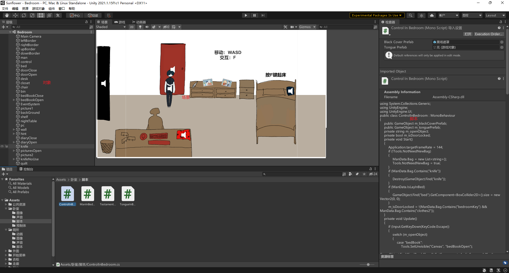

# 学习路线

## 目标

做游戏

## 需要学什么

* 游戏引擎
  * Unity
  * Unreal Engine 4
  * Cocos 2D
  * 等
* 图形学
  * OpenGL
  * DirectX
  * 等

其中，游戏引擎优先级更高，因为有了游戏引擎才能做游戏，图形学是更牛逼的东西，计算机图形学（Computer Graphics、CG）是如何在计算机中表示图形、以及利用计算机进行图形的计算、处理和显示的相关原理与算法，咱先不学。

说游戏引擎，Cocos是只能做2D的游戏，以前用的很多，手机游戏都是这个做的，Unreal很难，具体多难我不知道，但是懂行的同学跟我说你如果会了就真的无敌（上面的图形学也是差不多这种感觉），所以优先Unity。

Unity具体能干什么，我也只学了很浅层的东西，我理解里简单来说就是封装了一些功能的一个平台，能够用代码控制一个游戏场景里的各种对象（Object）事件和动作，包含人物移动、碰撞检测、动画、粒子特效、摄像机移动等等。

首先明确一点，所有计算机相关行业，实践很重要，这是个工科，想提升就是去写去做，遇到不会的百度，能理解的理解，不能理解的就抄。不用背，一段代码写十次你就记住了。

接下来是，如果短期目标是学Unity，建议从2D入手，因为3D游戏涉及到建模的问题，可以想象场景中的每一个对象应该对应于一个三维模型，一般是小组中的美工给出素材，但你没有，Unity 2D的话素材就都是图片，这个相对而言比较好找，百度就好了，甚至自己画都可以。

可以先试着做一些小游戏，比如说飞机大战、贪吃蛇、扫雷、打砖块这种游戏练练手。

接下来去学Unity 3D，素材的话去找B站教程下面的百度网盘链接，去跟着做，也算有经验了。

接下来去学高级的Unity效果，比如说粒子、着色器这种。

然后尝试跟项目，因为你不想策划，而一个好游戏其实最重要的就是策划，决定游戏背景、世界观、主要玩法这些东西，尝试去找一下项目组，找一下你们学校计院和美院的同学，应该不少想要做游戏的。

找工作的话其实挺看项目经历的，如果自带一个比较成熟的3D游戏，仙剑那种网游都可以，基本稳的。

## 怎么学

首先是，Unity使用C#语言开发，但是从我个人经历来看，C#不太适合第一门上手的语言，就像怎么跟一个不懂面向对象的人讲public class是什么意思，我觉得会有点怪。

所以我还是觉得C++学起，而且想要往后发展的话，UE4用C++开发的，学图形学的话OpenGL也是用C++开发的，所以总要学。

应该是C++→C#→Unity，C++去学语法和思维，C#就只学语法了，就是说这种思维学会了，用什么语言都能把他写出来，学语法就是在学怎么写，这个过程其实，记笔记，用到查百度，就是用到十遍就自然就会了，所以很简单的。思维就是，比如说如何使用分支、循环语句、算法、递归、面向对象是什么、函数是什么，这种，每个语言都有。语言不同的地方在于应用，比如说C++的应用场景更底层，C#的话写一个Winform非常方便，而且可以用来写Unity，Python写人工智能和数据处理的多，Javascript用来写前端网页。所以说更像是，我为了用Unity专门去学了C#，我为了写网页学了JavaScript，这种感觉。

好，如果你同意我上面的观点，就先去学C++，[黑马程序员匠心之作|C++教程从0到1入门编程,学习编程不再难_哔哩哔哩_bilibili](https://www.bilibili.com/video/BV1et411b73Z?p=1)，就用这个，这个里面的视频到P184之前，就是STL之前要全部看完，STL是更高级的东西，之后OpenGL用到再说。P184里面，有几个大项目，通讯录管理系统、职工管理系统这种，可以跳过，别的小例子看一看。他应该是每一个知识点是先语法，然后案例，建议是先看语法，到案例停一下，自己写一下，再看。
