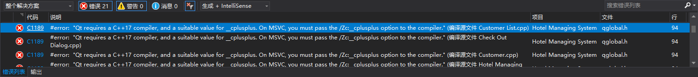
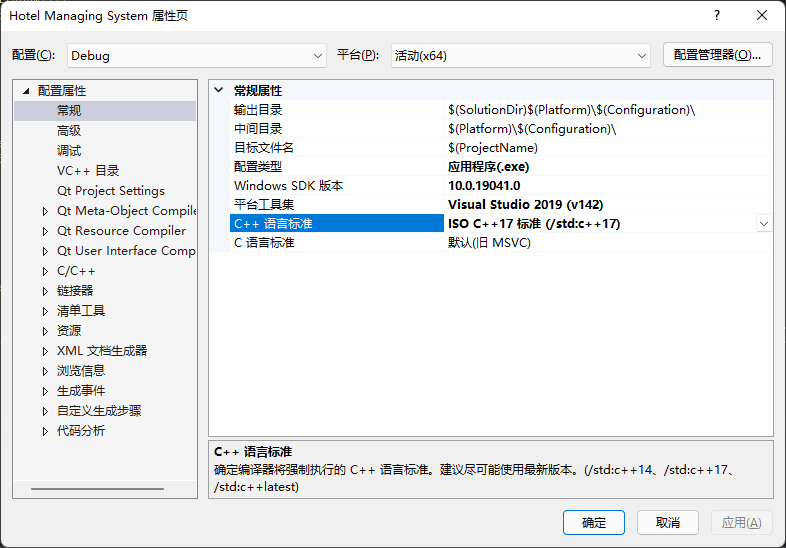
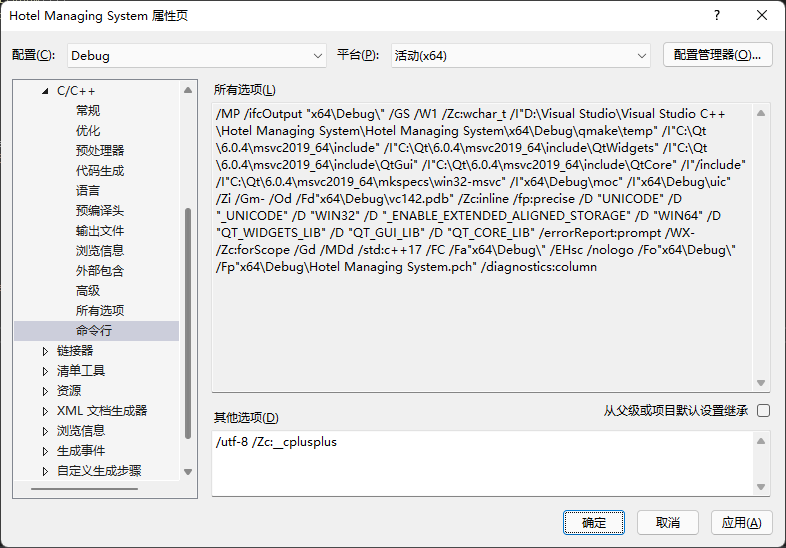

# VS2019编译Qt 6.2.0+项目时出现“Qt requires a C++17 compiler”错误

## 错误信息

> 严重性    代码    说明    项目    文件    行  禁止显示状态
> 错误  C1189   #error:  "Qt requires a C++17 compiler, and a suitable value for __cplusplus. On MSVC, you must pass the /Zc:__cplusplus option to the compiler." (编译源文件 Customer List.cpp)  Hotel Managing System   C:\Qt\6.2.0\msvc2019_64\include\QtCore\qglobal.h    94

## 错误图示

## 错误原因

从Qt 6.0开始，需要使用C++17标准，升级到Qt 6.2.0后使用VS2019编译项目报错。

## 解决方案

需要配置Debug和Release的属性。

1. 项目(P)→%项目名称% 属性(<u>P</u>)→配置属性→常规→常规属性→C++ 语言标准→选择`ISO C++17 标准 (/std:c++17)`
   
2. 项目(<u>P</u>)→%项目名称% 属性(<u>P</u>)→配置属性→C/C++→命令行→其他选项(<u>D</u>)→添加 `/Zc:__cplusplus`
3. 确定

如果需要新建Qt 6.0以上的项目，建议在建立项目时对上面两个属性进行修改。
